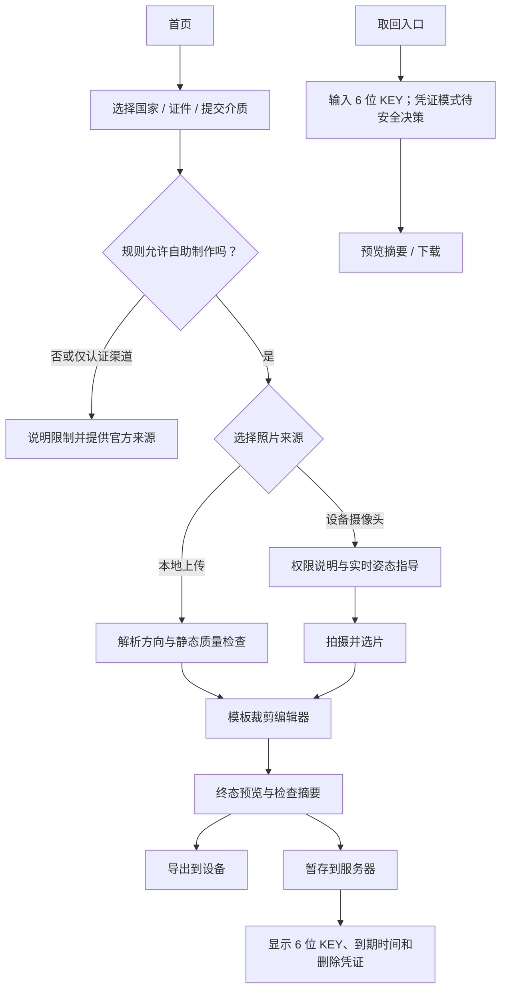

# Portrait Booth — PRODUCT

> 当前状态：产品与技术规格阶段，以 [STATUS.md](../STATUS.md) 为准。
> 调研基线：2026-08-05
> 文档用途：定义产品问题、目标、边界、流程、需求和验收事实，不替代各证件签发机关的最新规则。

## 1. 产品定义

Portrait Booth 是一个无需账户即可使用的 Web App。用户先选择目标证件模板；如果儿童/成人等申请人类别会改变规则，再补充选择该类别。系统固定当时最新的有效模板版本，然后用户上传照片或调用设备摄像头拍摄；应用用取景指引和本地脸部几何分析帮助用户调整正脸角度、距离和位置，随后提供裁剪、移动、缩放、旋转及镜像等基础编辑，最终生成目标尺寸照片。

完成编辑后有两个并列终态：

1. **导出**：把当前终态照片下载到用户设备。
2. **暂存**：把同一编辑终态渲染出的照片保存到服务器，返回唯一的 6 位大写字母或数字 KEY，供用户稍后或在另一设备取回。

这里的“同一终态”是一份不可变的终态工件：它固定模板版本、裁剪区域、缩放、旋转、镜像、方向和输出尺寸。导出和暂存只是这份工件上的两个非互斥操作；任何继续编辑都会使旧工件失效并重新生成。服务器为安全而重新编码时，取回文件不要求与本地文件字节级一致，但构图、方向和像素尺寸必须一致。

## 2. 要解决的问题

- 用户不清楚不同护照、签证及证件的照片尺寸和构图规则。
- 自拍时很难同时判断偏航、俯仰、侧倾、距离、眼位和头部大小。
- 通用图片编辑器不理解证件模板，尺寸正确也不代表构图或提交渠道正确。
- 用户常需在手机拍摄、在电脑申请，或把照片交给打印店，跨设备转移不顺畅。
- 同类工具常在最后一步收费、把照片长期留存在服务器，或含糊宣称“保证获批”。

## 3. 目标用户与待办任务

### 3.1 主要用户

- 临时需要制作护照、签证或其他证件照的个人。
- 只有手机摄像头、没有专业拍摄设备的用户。
- 需要从拍摄设备切换到申请或打印设备的用户。
- 希望手动掌控裁剪、不接受自动美化或改变外貌的用户。

### 3.2 Jobs to be Done

- “当我准备线上证件申请时，我希望快速得到尺寸和文件格式正确的照片，并知道仍有哪些风险。”
- “当我自拍时，我希望应用明确告诉我头应该往哪边调整，而不是只在拍完后说不合格。”
- “当我在手机完成照片后，我希望用一个容易抄写的 KEY 在另一台设备取回成品。”
- “当官方规则不允许自拍或数字修改时，我希望在浪费时间前就得到提示。”

## 4. 产品目标与非目标

### 4.1 MVP 目标

- 覆盖上传和浏览器摄像头两种输入。
- 在摄像头预览中提供正脸角度、距离、位置和基础拍摄环境提示；分析不可用时仍可手动拍摄。
- 让用户先选国家/地区、证件、提交介质及必要的申请人类别；系统选择并固定当前有效模板版本，再进入拍摄与编辑。
- 提供基于模板的裁剪蒙版、移动、缩放、旋转、镜像、撤销和重置。
- 输出单张 sRGB JPEG，并明确区分“尺寸已生成”“检测通过”和“官方最终接受”；纸质模板只有在 JPEG 写入正确打印密度并通过校准打印后才可标为 `print-ready`。
- 让导出和暂存共享同一终态生成步骤。
- 无账户暂存一个终态成品，生成唯一 6 位大写字母或数字 KEY，并可输入 KEY 取回。
- 对暂存照片实施短期留存、自动删除、主动删除和防枚举控制。

### 4.2 后续候选

- 4×6 英寸、10×15 cm 等多张冲印排版和 PDF。
- 更多由内容运营审核过的国家、证件和渠道模板。
- 在规则允许时提供背景均匀度辅助；背景替换单独评估，不默认启用。
- QR 码、私密取件链接或系统分享面板；如果采用第二取件凭证，这些能力将进入 P0。
- 专业摄影师或人工复核服务。
- 离线/PWA、批量照片、组织级品牌模板。

### 4.3 明确非目标

- 不代办护照、签证或其他政府申请。
- 不承诺照片一定获批，也不冒充签发机关的官方检查器。
- 不做人脸身份识别、1:N 人脸搜索或身份验证。
- 不做美颜、换脸、五官重塑、生成式补脸或改变真实外貌的编辑。
- MVP 不提供永久相册、账户体系、社交发布、实体冲印或支付。
- 不把“常见 35×45 mm”当作所有国家、证件和渠道通用的法律标准。

## 5. 产品原则

1. **隐私默认**：上传、摄像头帧、脸部几何分析和普通导出均留在浏览器；只有用户主动选择“暂存”时，终态照片才发送到服务器。
2. **先说明适用性**：模板不仅包含宽高，还包含申请渠道、是否允许自拍、是否允许裁剪/镜像/背景处理及来源日期。
3. **指导而非裁决**：自动检测说明“发现什么、如何调整、哪些规则未检查”，不使用未经证明的“100% 合规”文案。
4. **编辑可逆**：任何变换都可撤销和重置，不覆盖用户原图。
5. **规则可追溯**：每个可发布模板必须有版本、官方来源和复核日期；规则过期时可远程停用。
6. **无障碍降级**：脸部分析失败、性能不足或用户拒绝摄像头权限时，上传、手动蒙版和文字指导仍可完成任务。

## 6. 核心体验

### 6.1 首次创建

1. 用户按国家/地区、证件类型、纸质/数字及申请渠道选择模板。
2. 应用先显示关键规则、官方来源、最近复核日期和自助制作限制；普通用户不手动选择历史模板版本。
3. 用户选择上传或摄像头。摄像头权限只在点击该选项后请求。
4. 摄像头模式依次提示：只检测到一张脸、面对镜头、头部摆正、保持合适距离、光线/清晰度基本可用；连续稳定后允许自动倒计时，也始终保留手动快门。上传照片也执行一次静态角度/位置分析，并在无法靠裁剪修复时建议重拍。
5. 用户在模板蒙版中移动和缩放照片，并可按模板政策旋转、镜像。
6. 完成页列出通过项、警告项、未检查项、需人工确认项和官方最终审核提示。
7. 用户选择导出或暂存；两者不串联，也不要求先下载或先保存。

### 6.2 暂存与取回

- 暂存仅保存终态照片，不保存摄像头视频、逐帧图像、脸部关键点、原图或编辑历史。
- 一次暂存生成一个总长度恰好为 6 位的 KEY；每一位独立从 `A–Z` 或 `0–9` 中均匀选择，不规定字母和数字各自数量，也不强制两类都出现。一个 KEY 在产品生命周期内不得映射到另一张照片。
- “一 KEY 一照片”按保存记录解释：同一幂等重试返回同一 KEY；用户主动再次独立暂存可以得到新 KEY，不对人像内容做全局去重。
- 暂存采用由服务政策明确声明的短期留存；确认前显示权威留存时长和预计到期时间，保存成功后显示服务端返回的绝对 `expiresAt`。
- 保存成功页同时显示 KEY、到期时间、复制按钮和独立删除凭证。删除凭证只在创建响应中提供，可复制或下载为删除回执；页面会话内可暂存，关闭后不保证可恢复。
- 跨设备取回要求用户输入 6 位 KEY。由于 KEY 不能作为强认证凭证，公开取回实现还必须满足 [SPEC](SPEC.md) 规定的授权、防枚举、限速、统一错误、缓存和日志约束；当前仓库尚无公开取回实现。
- 取回成功后允许下载。删除权限与下载权限分离：只有保存时获得独立删除凭证且当前浏览器仍持有它时才显示“删除”；仅凭 KEY/取件凭证不能删除，避免猜中者造成删除型拒绝服务。
- 无效、已过期和已删除使用相同错误文案。
- 到期后立即禁止任何 API 访问，并在 60 分钟内删除应用可访问的主对象、版本和临时副本；MVP 照片存储桶不做长期备份。如基础设施仍产生应用不可恢复的灾备副本，必须另行披露并在不超过 30 天内销毁。

> **上线阻断风险**：由 26 个大写字母和 10 个数字组成的 6 位 KEY 共有 `36^6 = 2,176,782,336` 种组合，约 31.0 比特，仍不能视为强认证凭证。若坚持只凭 KEY 跨设备取回，必须先定义并书面接受最大同时有效照片数、全局解析请求预算和自动关闭阈值，再同时上线短留存、多维限速、递增延迟、失败阈值 CAPTCHA、统一错误和短时下载会话。CAPTCHA 和单 IP 限速不是认证替代品。若延长留存或扩大规模，产品必须增加第二个秘密或改为更长代码。

### 6.3 模板不适用时

- 模板可以标为 `reference_only` 或 `unsupported`，仍向用户展示官方规则和来源，但不提供“可提交成品”的承诺。
- 例如加拿大护照要求商业摄影师且禁止数字修改；英国在线护照要求提交包含上半身的原图并由官方流程裁剪；[德国联邦门户](https://verwaltung.bund.de/leistungsverzeichnis/DE/leistung/99085001012000/herausgeber/BY-358/region/09162)说明自 2025-05-01 起境内护照/身份证照片采用现场或认证云传输。这些不能被一个通用裁剪框掩盖。

## 7. MVP 功能优先级

| 优先级 | 能力 | MVP 结果 |
| --- | --- | --- |
| P0 | 模板选择与来源披露 | 可按国家、证件、介质和渠道筛选；仅启用已复核模板 |
| P0 | 上传与摄像头 | JPEG/PNG/WebP 上传；HTTPS 下请求相机；拒绝权限可回到上传 |
| P0 | 拍摄指导 | 单脸、偏航/俯仰/侧倾、距离/头框、稳定度与基础质量提示 |
| P0 | 裁剪编辑 | 拖移、缩放、细微旋转、90° 旋转、镜像、撤销、重置 |
| P0 | 终态检查 | 精确像素/比例、头部位置及模板政策检查，区分错误/警告/未知 |
| P0 | 单图导出 | 浏览器本地生成 sRGB JPEG；移除 EXIF；纸质模板写入正确 PPI 并校准打印；显示文件规格 |
| P0 | 暂存与取回 | 一图一 KEY、服务政策声明的固定短 TTL、下载、主动删除、自动清理 |
| P0 | 隐私与滥用防护 | 明确告知并主动确认、最小存储、限速、CAPTCHA 升级、私有对象存储 |
| P1 | 冲印排版 | 4×6 英寸/10×15 cm 多张排版及 PDF |
| P1 | 更深质量检测 | 背景均匀度、阴影、眩光、闭眼、嘴部状态的可解释提示 |
| P2 | 专业服务 | 人工审核、摄影师传输、实体冲印或付费能力 |

## 8. 竞品与可借鉴模式

调研快照截至 2026-08-05；产品能力、价格和隐私政策会变化，开发前应重新核对。

| 产品/服务 | 已观察能力 | 对本项目的启示 |
| --- | --- | --- |
| [PhotoAiD](https://photoaid.com/) / [Passport Photo Online](https://passport-photo.online/how-it-works) | 上传/拍摄、AI 自动裁剪和背景处理、人工复核、大量模板；下载和实体照片 | 自动化反馈有价值，但不能复制“保证合规”文案；第三方处理商和较长留存需清楚披露 |
| [IDPhoto4You](https://www.idphoto4you.com/?Target=HelpPage) | 73 国模板、手动生物识别蒙版、移动/缩放/旋转、单图和冲印排版 | 模板蒙版与透明手动控制适合 MVP；其[隐私页](https://www.idphoto4you.com/?Target=PrivacyPage)所示最长 6 小时留存可作为最小化参考 |
| [PersoFoto](https://www.persofoto.de/upload/passbild) | 已确认文件上传、拍摄说明、生物识别蒙版、免费裁剪与付费服务并列；页面把 webcam 作为拍摄来源建议，但未确认浏览器内直接调用 | “完成后下载或进入服务端流程”的并列终态最接近本产品；其[隐私资料](https://www.persofoto.de/de/datenschutz)称使用随机加密链接，但未公开长度或熵 |
| [123PassportPhoto](https://www.123passportphoto.com/) | 上传、自动/手动裁剪、背景处理、常见国家模板和冲印排版 | 打印排版是明确的 P1 需求；其[隐私政策](https://www.123passportphoto.com/privacy.php)称照片在 1 小时内删除 |
| [IDstation.online](https://www.idstation.online/default/Default) | 合作摄影商上传；用户凭 personal code 跨设备查看、下载或删除；含 CAPTCHA 和失败锁定 | 是 KEY 取回最接近的商业参照，但其代码为大小写敏感字母数字且有额外防自动化措施 |
| [GOV.UK Photo Code](https://www.passport.service.gov.uk/help/photo-codes) | 6–8 字符短 URL 路径把照片加入在线申请 | 短码并非唯一安全边界：政府取图请求还有 JWS 签名验证；本产品不能把“官方也用短码”当作 KEY-only 安全证明 |
| [芬兰警方照片代码](https://poliisi.fi/en/submitting-passport-photographs) | 摄影棚把照片传至警方服务器，用户在申请中输入 retrieval code | 验证了跨设备照片代码的用户价值，也说明认证来源和下载权限与普通云相册不同 |

### 8.1 差异化机会

- 竞品多为拍前静态说明和拍后判定；实时、可解释的偏航/俯仰/侧倾指引仍有差异化空间。
- 免费工具多缺少跨设备取回，商业工具多依赖邮箱、订单或长链接；无账户短 KEY 是便利点，也是核心安全风险。
- “模板尺寸 + 渠道限制 + 编辑政策 + 来源版本”比单纯堆叠国家尺寸更可信。
- 隐私默认的本地处理可成为明确价值主张：只有“暂存”会上传终态照片。

### 8.2 MVP 最低模板范围

Public Beta 的硬最低 release manifest 如下；除通用肖像外先只发布已单独复核的成人 revision。任何一项失败都会阻止 Public Beta；缩小集合属于产品范围变更，必须同步修改 PRODUCT、SPEC 和 release manifest，不能在发布评审中静默豁免：

- 通用肖像 1200×1200 px（明确标为非官方模板，允许镜像，用于基础肖像与编辑能力）。
- 美国护照—纸质 2×2 in（50.8×50.8 mm）；产品采用 300 ppi 时为 600×600 px。
- 美国签证—适用 DS-160/DS-1648 的数字照片，600–1200 px 正方形；不覆盖 DS-260、DV 或馆站特殊规则。
- 芬兰警方证件—数字 500×653 px。
- 中国签证—首个数字 revision 固定 354×472 px，且绑定已复核的具体受理来源。
- 日本护照—纸质 35×45 mm；产品采用 300 ppi 时为 413×531 px。

美国 DV 只在具体项目年度说明和适用申请窗口已正式发布时加入当期 manifest，不作为无条件发布门槛；每个年度单独复核和版本化。美国和日本纸质模板只有在正确 PPI 编码与校准打印测试通过后才可成为 `active`。儿童/婴儿、英国纸质/在线护照、加拿大护照及通用 Schengen 入口先以 `reference_only` 或渠道说明呈现：英国纸照公开规则禁止从较大图片裁切，英国在线路径由官方服务裁剪，加拿大要求商业摄影师原始文件，不能伪装成通用自助裁剪模板。

## 9. 验收事实

- 用户可以通过本地上传或明确授权的设备摄像头取得照片；摄像头、自动指导或模型不可用时仍可通过上传和手动路径完成。
- 用户可以根据所选模板移动、缩放、裁剪，并按模板政策旋转或镜像；预览与终态使用同一变换规则。
- 导出和暂存使用同一不可变终态工件；服务器安全重编码后允许字节不同，但构图、方向和像素尺寸必须保持一致。
- KEY 必须匹配 `^[A-Z0-9]{6}$`，全字母、全数字和任意混合均有效；同一个 KEY 永不映射到另一张照片。
- 每次输出显示模板 ID、版本、来源、复核日期、通过项、警告项和未检查项。
- 到期或删除的照片立即不可取回；日志、分析和错误追踪不包含照片、KEY、取件或删除凭证、对象存储标识或脸部关键点。
- 终态页不得把启发式检查描述为官方批准、官方认证或受理保证。

## 10. 风险与应对

| 风险 | 影响 | 产品应对 |
| --- | --- | --- |
| 官方规则变化或渠道差异 | 输出尺寸正确但申请被拒 | 模板版本化、官方来源、复核日期、远程停用和 `reference_only` 状态 |
| 6 位 KEY 可枚举 | 未授权查看人像 | 固定短 TTL、分层限速、CAPTCHA、统一错误、私有对象存储；长留存或规模扩大前升级凭证模型 |
| 自动检测误判或群体偏差 | 错误指导、排除部分用户 | 可解释检查、置信度、手动绕过、跨肤色/年龄/辅助设备测试，不做身份识别 |
| 摄像头质量、权限或性能不足 | 无法拍摄或低帧率 | 延迟请求权限、上传回退、可关闭实时分析、使用原始高分辨率帧导出 |
| 某些官方规则禁止自拍或编辑 | 产品能力与规则冲突 | 模板级 `submissionMode` 和 `editingPolicy`；不合适模板只做参考 |
| 上传接口被当作文件托管 | 成本、违法内容或恶意文件 | 只接受可解码白名单图像、限制尺寸/像素、重编码、短 TTL、限额和私有下载 |
| 用户误把镜像预览当成成品 | 面貌方向错误或被拒 | 前置相机可镜像预览但默认保存非镜像；官方模板按政策禁止或强警告镜像 |
