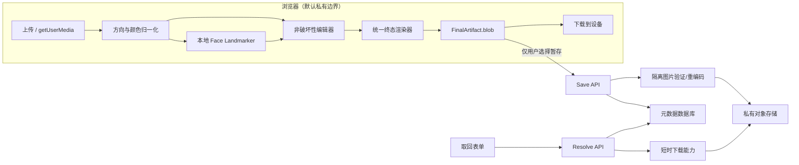

# Portrait Booth — SPEC

> 状态：Draft v0.1
> 基线日期：2026-08-05
> 关联产品文档：[PRODUCT.md](./PRODUCT.md)
> 约束词：`MUST`/必须、`SHOULD`/应该、`MAY`/可以按 RFC 2119 语义理解。

## 1. 范围与关键决策

本规格覆盖一个无账户 Web App 的 MVP：模板选择、照片上传、设备摄像头、脸部角度指导、基础编辑、精确尺寸渲染、导出、短期服务器暂存、6 位大写字母或数字 KEY 取回以及模板内容管理。

### 1.1 Draft 实现假设

- 用户在拍摄前选择 `国家/地区 + 证件 + 提交渠道`；只有规则发生差异时才补充 `申请人类别`。
- 原图、摄像头视频帧、脸部关键点和编辑状态默认仅存在于浏览器内存。
- “导出”完全可在客户端完成；只有选择“暂存”才把终态成品上传服务器。
- 服务器只保存终态成品，不保存原图、中间帧、脸部几何、身份 embedding 或编辑历史。
- 暂存 TTL 固定为 30 天（2026-08-06 产品确认，由基线 24 小时变更，见 §1.2.1）；显示服务政策的预计留存，保存后显示服务端权威 `expiresAt`。
- 一个 KEY 只对应一张终态照片；过期或删除后也不得复用于另一张照片。
- “一 KEY 一照片”按保存记录解释：同一幂等请求始终返回同一 KEY，独立保存同一视觉内容可以产生新 KEY；不做会扩大隐私处理范围的内容去重。
- 自动检查是拍摄和构图辅助，不是政府受理保证。

### 1.2 P0 安全决策门

用户需求基线是“根据总长度为 6 位、每位均为 `A–Z` 或 `0–9` 的 KEY 自行取得照片”，即 KEY-only。字母和数字各自数量不限，也不强制两类都出现。36 字符空间为 `36^6 = 2,176,782,336`，约 31.0 比特。它可通过唯一约束解决生成碰撞，但仍不能单独提供保护肖像照片所需的强认证。

实现前必须在以下两种策略中确认一种：

| 策略 | 需求兼容性 | 安全性 | 规格结论 |
| --- | --- | --- | --- |
| `key_only_ephemeral` | 完全符合“只输入 KEY” | 依赖 30 天 TTL（§1.2.1）、容量上限、限速、CAPTCHA（暂缓）和监控；仍有分布式枚举剩余风险 | 已按 §1.2.1 产品决策选定；剩余风险接受记录见该节 |
| `key_plus_claim` | 保留 6 位 KEY，但跨设备还需私密链接/QR 中的 ≥128 比特访问密钥 | 推荐；KEY 是定位码，访问密钥才是访问证明 | 推荐安全变体，但属于产品需求偏差，未经确认不得视为已采用 |

该决策已于 2026-08-06 选定为 `key_only_ephemeral`（见 §1.2.1）。两种策略都必须生成独立的删除密钥。任何实现不得把 KEY 当作对象存储路径、公开 URL 或强密码来描述。

#### 1.2.1 决策记录（2026-08-06，产品确认）

- **策略**：选定 `key_only_ephemeral`。API、客户端与数据模型按此实现；不实现 `key_plus_claim` 分支。
- **暂存 TTL**：30 天，由 §1.1 基线 24 小时变更。`service-policy` 返回 `temporaryStorageTtlSeconds = 2592000`。
- **威胁评审**：产品决定永久忽略正式威胁评审流程，不再作为 Public Beta blocker。§9.3 中的低成本工程控制（限速、失败阈值、统一错误、预算自动关闭、无静默续期、监测告警）全部保留并实现；CAPTCHA 暂缓为后续增强，接口保留 `captchaToken` 字段兼容。
- **剩余风险**：分布式枚举在 30 天留存与更大容量下的剩余风险由产品按此记录接受。

## 2. 系统边界



### 2.1 逻辑组件

- **Web Client**：模板浏览、相机、上传解码、姿态分析、编辑、终态渲染和本地下载。
- **Template Service**：发布版本化模板清单，可停用过期模板；公开只读。
- **Save/Retrieve API**：接收终态照片、生成 KEY/凭证、解析取回、删除和限速。
- **Image Validator**：在隔离、低权限、无外网环境中实际解码并重编码服务器暂存图。
- **Private Object Storage**：无公开 ACL；短生命周期；对象名与 KEY 无关。
- **Metadata Store**：保存映射、模板版本、生命周期和摘要，不保存图像二进制。
- **Lifecycle Worker**：使到期对象立即不可访问，并在 SLO 内完成物理删除和审计。

框架、数据库和云供应商尚未选择；首次实现应优先使用项目约定和现有依赖，避免在本规格阶段锁死技术栈。

## 3. 页面与状态

### 3.1 建议路由

| 路由 | 用途 | 注意事项 |
| --- | --- | --- |
| `/` | 首页、创建或取回入口 | 不请求摄像头权限 |
| `/create` | 模板、来源、拍摄、编辑和完成向导 | 编辑状态仅在内存；刷新前提示 |
| `/retrieve` | KEY 输入、访问证明兑换和下载；仅在本浏览器另持删除密钥时显示删除 | KEY 不放入 URL、query 或 referrer；下载凭证不自动授予删除权 |
| `/privacy` | 简明与完整隐私说明 | 无需加载相机/分析模型 |
| `/templates/:id` | 模板规则、来源与版本历史 | 不把非官方推导值标成强制规则 |

### 3.2 客户端创建状态机

`template-selection → source-selection → permission/capture-or-upload → review → edit → validate → final-ready`

- 选择新原图会清除此前终态 Blob 和分析结果。
- 更换模板必须重新计算裁剪、输出尺寸和规则检查；不可静默沿用不兼容变换。
- `final-ready` 持有一份不可变 `FinalArtifact`，是唯一允许执行导出或暂存的共享状态。
- 导出和暂存是该工件上的非互斥副作用，不是会替换 `final-ready` 的新状态；同一工件可以先后执行两者。
- 任何源图、模板或变换变化都会立即销毁旧工件及其检查摘要，并回到 `edit`/`validate`；不得把旧 Blob 继续用于另一操作。

### 3.3 服务端照片状态机

`validating → active → access-revoked → purging → purged`

- `active` 前不可取回。
- 到达 `expiresAt` 或收到有效删除请求时，事务内进入 `access-revoked` 并撤销所有下载能力；同步鉴权不得依赖异步清理任务是否已运行。
- 验证失败不保留照片正文：清理 staging 后直接结束请求；只有不含图像的短期错误分类可留作运维统计。
- `access-revoked`、`purging`、`purged` 和不存在对取回者返回统一结果；`purged` 后删除照片关联元数据，只保留不含人物信息的 KEY 登记项。

## 4. 功能需求

### 4.1 模板选择

| ID | 要求 | 验收摘要 |
| --- | --- | --- |
| TMP-001 | 系统必须先让用户选择国家/地区、证件类型和提交渠道；规则因儿童/成人等申请人类别而异时再要求选择类别 | 相同国家的纸质和数字规则可分别选择；无差异时类别固定为 `all`，不增加无意义步骤 |
| TMP-002 | 每个证件模板必须展示官方来源、来源更新时间（若有）、本项目复核日期、状态和限制；非官方通用肖像模板展示项目内部规格、版本和“非证件模板”标识 | 用户可在创建前打开证件模板的官方来源；通用模板不得伪装成官方规则；过期来源可停用 |
| TMP-003 | `reference_only`/`unsupported` 模板不得显示“可提交成品”或“已合规” | 加拿大自拍、英国在线预裁剪等限制有醒目说明 |
| TMP-004 | 模板更新必须生成新版本；已打开的编辑会话固定使用其开始时版本 | 终态和暂存记录都含 `templateId + templateVersion` |
| TMP-005 | 不得提供无受理国上下文的“通用 Schengen 35×45 法定模板” | EU 中央规则页只作为入口；用户须选受理成员国/使领馆 |

### 4.2 上传

| ID | 要求 | 验收摘要 |
| --- | --- | --- |
| SRC-001 | MVP 客户端接受可实际解码的 JPEG、PNG、WebP | `accept` 属性不是安全检查；错误扩展/MIME 不能绕过实际解码 |
| SRC-002 | 单个源文件默认上限 15 MB、24 MP、任一边 8,000 px；限制应可配置且须经一级移动设备真机验证 | 先解析文件头尺寸再进入完整解码；工作位图按模板所需分辨率受控缩放，超限显示可操作错误 |
| SRC-003 | 必须按 EXIF orientation 归一化到实际像素方向 | 1–8 全部 EXIF 方向均有自动测试；编辑坐标不依赖 EXIF |
| SRC-004 | HEIC/HEIF 可在能力检测后作为增强，但不属于跨浏览器 MVP | 不支持时明确提示转换或改用相机，不静默失败 |
| SRC-005 | 选择本地文件不得自动上传 | 网络检查证明导出路径未发送照片内容 |

### 4.3 摄像头与拍摄

| ID | 要求 | 验收摘要 |
| --- | --- | --- |
| CAM-001 | 仅在用户点击“开启摄像头”后调用 `getUserMedia`，且 `audio:false` | 初始加载不出现权限提示，也不请求麦克风 |
| CAM-002 | 摄像头必须运行在 HTTPS/安全上下文；权限拒绝、无设备、设备占用和约束失败均提供上传回退 | 任一错误都不锁死创建流程 |
| CAM-003 | 首次请求使用 `{audio:false, video:{facingMode:{ideal:'user'}, width:{ideal:1920}, height:{ideal:1080}}}`，不使用 `exact/min/max` | 失败时允许用户用 `video:true` 重试；理想约束不满足不应被当成常态 `OverconstrainedError` |
| CAM-004 | 预览可 CSS 镜像，但分析坐标和默认成品必须为非镜像真实方向 | 前置相机导出与源帧方向一致；overlay 横坐标正确映射 |
| CAM-005 | 每次相机请求使用递增 generation/session token；离开步骤、接受照片、隐藏页面超时或组件卸载时停止全部 tracks，迟到成功的旧请求也必须立即停止其返回 tracks | 浏览器权限 Promise 在离开后才成功时也不会绑定视频或泄漏 track；UI 取消只取消应用会话，不声称取消浏览器权限提示 |
| CAM-006 | `ImageCapture.takePhoto()` 仅作能力检测后的高分辨率增强；基线从 `<video>` 固有像素捕获到 Canvas | Firefox/Safari 不支持 ImageCapture 时仍可完成拍摄 |
| CAM-007 | 自动拍照必须由用户显式开启，保留手动快门、取消倒计时和重拍 | 不强迫用户在限时内完成动作 |
| CAM-008 | 授权后可枚举并切换摄像头；发起新请求前停止旧 tracks，并用 CAM-005 的 token 丢弃乱序结果 | 前后摄像头反复切换无双流、旧画面回跳或残留指示 |

### 4.4 脸部角度与质量指导

推荐在设备端使用 MediaPipe Face Landmarker；模型和包版本必须锁定。采用前必须审计锁定构建的实际网络行为：官方 Tasks 隐私通知说明输入留在设备端，但 SDK 可能发送性能/使用指标。优先选择经验证不外发遥测的构建；若存在厂商指标，必须在模型初始化前披露字段、处理商、区域和法律基础并取得适用同意，且提供不加载模型的手动路径。

最小配置固定为 `runningMode:'VIDEO'`、`numFaces:2`、`outputFacialTransformationMatrixes:true`、`outputFaceBlendshapes:false`，检测/存在/跟踪 confidence 阈值与模型版本一起校准和发布。`numFaces>1` 时不能依赖内置平滑，应用必须执行主脸关联、时序平滑和迟滞。

主线程用 `requestVideoFrameCallback`（回退 `requestAnimationFrame`）为新帧创建可转移 `ImageBitmap`；Worker 同时只允许一次同步推理，至多保留一张最新待处理帧，替换或完成后立即 `close()`。`detectForVideo(frame, timestampMs)` 使用单调递增毫秒时间戳，结果携带 session/frame ID；旧会话结果必须丢弃。退出步骤时关闭 bitmap、Landmarker 和 Worker。

| ID | 要求 | 验收摘要 |
| --- | --- | --- |
| GDE-001 | 实时状态至少覆盖：未检测到脸、多脸、位置/大小、yaw、pitch、roll、稳定、可拍摄 | 每种状态有文字与图形，不只依赖颜色 |
| GDE-002 | 指令以用户身体方向表达，例如“脸向你自己的左侧微调”，不可含糊使用“屏幕左边” | 镜像与非镜像预览测试均给出正确方向 |
| GDE-003 | 姿态值可从 facial transformation matrix 推导，但矩阵布局、轴向和符号必须用固定样本校准 | 正面、左/右转、抬/低头、左右倾斜样本全部通过 |
| GDE-004 | 初始工程阈值建议为 `abs(yaw)≤7°`、`abs(pitch)≤7°`、`abs(roll)≤5°` 且稳定 ≥800 ms；阈值必须配置化 | UI 标为拍摄启发式，不称为官方法定容差 |
| GDE-005 | 自动或手动拍摄固定确切 Blob/Bitmap 后必须再跑一次静态检查，不使用倒计时开始或最后一次预览推理的旧结果 | 人在倒计时中移动时不会保存旧“通过”状态；复检对象与进入编辑器的像素一致 |
| GDE-006 | 模型失败、置信度低或性能不足时只关闭自动指导，不阻止手动拍摄/上传/编辑/导出 | 无 WebGL/WASM/Worker 的降级测试可完成全流程 |
| GDE-007 | 脸部关键点、矩阵、角度和分析帧不得持久化、上传或写入遥测 | 网络、日志、IndexedDB/localStorage 检查无相关数据 |
| GDE-008 | 头顶 crown、头发顶部、背景与眩光等模型不能可靠确定的项目必须标为人工确认或未检查 | 检查摘要区分 `pass/warn/fail/unknown/manual`（manual 为模板要求机器判不了、需人工确认的项） |
| GDE-009 | 上传照片也必须执行一次静态位置及 yaw/pitch/roll 分析；无法用裁剪修复时建议重拍 | 固定上传样本能得到与同一捕获帧一致的角度结论，用户仍可手动继续 |
| GDE-010 | 对实际捕获/上传的静态图执行可解释的曝光剪切与清晰度检查；指标、归一化尺寸和阈值随质量配置版本发布，未获官方依据时只给 `warn/unknown` | 固定欠曝、过曝、运动模糊、失焦和正常许可样本得到稳定分类；无脸/低置信度时不伪造“通过” |

为防指令抖动，应使用平滑、进入/退出迟滞和状态优先级；状态更新目标为 8–15 FPS，渲染线程不得因推理阻塞编辑控件。

`QualityConfig` 至少固定：版本、脸部 ROI/整图回退策略、亮度颜色空间、暗/亮剪切像素阈值与比例、清晰度算子、归一化到 512 px 长边的方式、数值阈值和测试集版本。任何数值为空都不得启用质量提示；首版数值必须由 §12.3 固定样本校准并只触发警告，不能用设备自适应后仍显示不可解释的“通过”。

### 4.5 编辑器

| ID | 要求 | 验收摘要 |
| --- | --- | --- |
| EDT-001 | 编辑必须是非破坏性的，只保存变换参数，不反复重采样原图 | 多次修改后只在终态渲染一次 |
| EDT-002 | 提供拖移、缩放、细微旋转、90° 旋转、水平镜像、撤销、重做和重置 | 鼠标、触屏和键盘路径都能完成 |
| EDT-003 | 裁剪框锁定模板规定的输出比例；源图必须覆盖整个输出画布 | 不允许透明/空白边缘进入官方模板输出 |
| EDT-004 | 缩放下限为刚好覆盖裁剪框；上限同时受可用像素质量和交互上限约束 | 低于模板最小像素时显示不可忽略警告 |
| EDT-005 | 模板政策可禁用或警告镜像、背景处理、修饰和旋转 | 英国纸质模板禁止镜像；前置预览镜像不算用户编辑 |
| EDT-006 | “旋转照片以纠正脸歪”不得被当作姿态合规修复 | roll 检测基于原脸姿态；旋转只修正扫描/相机画布方向 |
| EDT-007 | 拖拽和双指手势必须有按钮、滑杆或数值输入替代 | 满足 WCAG 2.2 Dragging Movements 和键盘要求 |
| EDT-008 | 编辑器必须显示模板蒙版、头顶/下巴或眼线允许区间及其含义 | 自动关键点不可靠时用户仍可人工对齐 |
| EDT-009 | 终态检查必须检测裁剪区 alpha；官方模板禁止背景处理时拒绝任何透明像素，只有模板明确允许时才可合成到指定 sRGB 背景 | PNG 转 JPEG 不会静默得到黑色或意外底色；合成操作进入变换/检查摘要 |

#### 4.5.1 变换模型

标准化源图坐标原点在左上角，终态保存以下参数：

```ts
type EditTransform = {
  translateX: number; // 归一化到输出宽度
  translateY: number; // 归一化到输出高度
  scale: number;      // 相对“刚好 cover”的倍率，>= 1
  rotationDeg: number;
  flipX: boolean;
};
```

渲染必须以同一仿射矩阵把方向已归一化的源像素映射到输出画布；矩阵约定固定为列向量、CSS 像素中心坐标、按 `cover → scale → flipX → rotation → translation` 组合，采样超出源边界即验证失败。预览和导出共用数学实现。浮点参数不可通过累计修改产生漂移，撤销记录参数快照而非已重采样位图；以金色向量覆盖四角、中心、90° 旋转、镜像和组合变换。

### 4.6 终态检查与导出

| ID | 要求 | 验收摘要 |
| --- | --- | --- |
| OUT-001 | 单次生成不可变 `FinalArtifact`，其中含 sRGB JPEG `blob` 及内存内 render manifest；导出使用该 Blob，暂存上传同一 Blob | 两个分支的上传/下载输入字节相同；服务器安全重编码后的取回图允许字节不同，但像素尺寸、方向和构图必须语义等价 |
| OUT-002 | 精确像素模板必须输出完全相同的宽、高、格式、颜色空间和文件大小约束 | 芬兰 500×653 和美国 DV 600×600 不允许 1 px 偏差 |
| OUT-003 | 有最大文件大小的 JPEG 使用有界质量搜索；不可为凑大小而改变规定像素 | 无法满足时清晰报错并建议更换源图，不输出违规文件 |
| OUT-004 | 输出必须去除 EXIF/GPS/嵌入缩略图和未知 metadata，方向写入实际像素 | 元数据扫描和旋转回归测试通过 |
| OUT-005 | MVP 的 `FinalArtifact.blob`、本地导出和服务器暂存统一为 JPEG/sRGB；其他输出格式属于后续能力 | 美国签证数字满足 JPEG、24-bit sRGB；Save API 与导出 MIME 不冲突 |
| OUT-006 | 物理尺寸模板若宣称“可按实际尺寸打印”，必须用锁定版本的确定性编码器写入正确 PPI，像素按 `round(mm / 25.4 * ppi)` 生成，并通过校准打印；否则只能标为参考图 | 原生 Canvas `toBlob` 常写 96 dpi；编码后重新解析尺寸、色彩和密度元数据，未通过不得标为 print-ready |
| OUT-009 | `ranged_pixels` 模板可由用户选择输出尺寸；候选值必须落在模板 min/max 范围、符合宽高比，存在 `allowedSizes` 时严格用它；选择贯穿编辑器画布、终态渲染、检查摘要与服务端校验 | us-visa-digital 默认 600×600、可选 1200×1200；服务端对越界/破比例尺寸返回 `PHOTO_SIZE_MISMATCH`，对落在范围内但超体积的成品走 OUT-003 搜索，下界仍超限才 `PHOTO_TOO_LARGE` |
| OUT-007 | 终态页必须显示输出像素、物理尺寸（若有）、格式、字节数、模板版本、警告及未检查项 | 下载前无需阅读隐藏说明即可看到关键风险 |
| OUT-008 | 输出文件名不得包含姓名或 KEY，建议 `{country}-{document}-{channel}-{yyyyMMdd}.jpg` | 文件名不暴露人像身份或访问凭证 |

```ts
interface FinalArtifact {
  artifactId: string; // 每次重新渲染生成的浏览器会话内随机 ID
  blob: Blob;         // image/jpeg，创建后不可变
  manifest: {
    schemaVersion: 1;
    templateId: string;
    templateVersion: number;
    widthPx: number;
    heightPx: number;
    mime: "image/jpeg";
    orientationNormalized: true;
    matrix: [number, number, number, number, number, number];
    flipX: boolean;
  };
}
```

manifest 只存在于浏览器内存，用于预览一致性、失效判断和 E2E 测试；MVP 不上传或持久化 manifest、源图摘要、变换摘要或普通内容哈希。服务端只按固定模板版本验证上传成品可观察到的尺寸、编码、方向和文件限制，不把客户端声明当证明。

### 4.7 暂存、KEY 与取回

| ID | 要求 | 验收摘要 |
| --- | --- | --- |
| SAV-001 | 选择暂存前必须显示会上传终态照片、保存目的、权威留存时长和预计到期时间并取得明确确认；保存成功后显示服务端 `expiresAt` | 仅导出流程不会触发该确认或网络上传；客户端不宣称在创建前知道精确绝对到期时间 |
| SAV-002 | 服务端必须对终态文件实际解码、限制资源并重新编码；只信任客户端字段是不允许的 | 伪 MIME、脚本、多格式混淆、超大像素和截断文件被拒绝 |
| SAV-003 | KEY 使用 CSPRNG 从固定字符集 `ABCDEFGHIJKLMNOPQRSTUVWXYZ0123456789` 无模偏差生成，数据库唯一；每个位置独立取值，不强制字母/数字配比，碰撞时重采样 | 可注入 RNG 的边界向量证明拒绝采样正确；全字母、全数字及任意混合结果都有效；并发生成不产生重复映射，随机性统计仅作离线健康检查 |
| SAV-004 | KEY 按字符串处理；输入去空格/ASCII 连字符并把 ASCII 字母转为大写，随后必须匹配 `^[A-Z0-9]{6}$`；显示可分组为 `A7C 2F9`，规范值为 `A7C2F9` | 保留开头的 `0`；手机复制、粘贴、手输和小写均能正确归一化；非 ASCII 字符和相似字形不被静默映射 |
| SAV-005 | KEY 不能复用；单一 Key Registry 在照片删除后保留不含人物信息的 keyed-HMAC 登记项 | 旧 KEY 永远不会在未来显示另一人的照片；分配与建图在一个事务内完成 |
| SAV-006 | 保存同时生成独立 ≥128 比特删除密钥；`key_plus_claim` 模式另生成 ≥128 比特访问密钥 | 数据库只保存版本化校验摘要；原密钥只在同一匿名会话可访问、最长 10 分钟的加密幂等响应窗口内可重放 |
| SAV-007 | 取回使用 POST body/安全 cookie，不把 KEY 或长期 secret 放进 URL/query | 代理、浏览器历史、referrer 和默认日志不含凭证 |
| SAV-008 | 无效、过期、已删除和未授权返回相同对外状态/文案，并采用近似处理时间 | 自动化差异测试在预设容差内 |
| SAV-009 | 验证成功后只签发短时、单用途下载能力；下载响应 `Cache-Control:no-store` | 能力过期或使用后不可重放 |
| SAV-010 | 用户只能凭创建时取得的独立删除密钥立即撤销照片；仅当当前浏览器仍持有删除密钥时显示删除入口 | 单凭 KEY、访问密钥或下载会话不能删除；删除后所有下载能力失效 |
| SAV-011 | 到期时同步禁止读取；分钟级生命周期任务在 60 分钟内删除主对象的所有版本、主复制件和临时文件 | 持续监控 purge backlog 和最老年龄并在 SLO 前告警；每日 canary 仅作补充验证 |
| SAV-012 | 同一匿名保存会话、同一 ≥128 比特 `Idempotency-Key` 和同一请求摘要必须返回同一个保存记录与 KEY | 重试不生成第二个 KEY；相同幂等键配不同 payload 返回 409；独立保存可生成不同 KEY |

## 5. 模板数据模型

### 5.1 最小模式

```ts
type RuleEnforcement = "mandatory" | "recommended";
type RuleProvenance = "source_literal" | "derived" | "portal_verified";
type TemplateStatus = "draft" | "active" | "reference_only" | "deprecated" | "unsupported";
type RuleUnit = "mm" | "px" | "ratio" | "degree";
type EditPolicy = "allowed" | "warn" | "forbidden";

type OutputProfile =
  | {
      kind: "exact_pixels";
      widthPx: number;
      heightPx: number;
      aspect: { width: number; height: number; enforcement: RuleEnforcement; provenance: RuleProvenance };
    }
  | {
      kind: "ranged_pixels";
      minWidthPx: number;
      minHeightPx: number;
      maxWidthPx: number;
      maxHeightPx: number;
      defaultWidthPx: number;
      defaultHeightPx: number;
      aspect: { width: number; height: number; enforcement: RuleEnforcement; provenance: RuleProvenance };
      allowedSizes?: Array<{ widthPx: number; heightPx: number }>;
    }
  | {
      kind: "physical_raster";
      widthMm: number;
      heightMm: number;
      printPpi: number;
      rounding: "nearest";
      widthPx: number;
      heightPx: number;
      pixelDerivation: "round(mm / 25.4 * printPpi)";
      ppiProvenance: RuleProvenance;
      calibrationProfileId: string;
    }
  | {
      kind: "portal_source";
      minWidthPx?: number;
      minHeightPx?: number;
      maxWidthPx?: number;
      maxHeightPx?: number;
      aspect?: { width: number; height: number; enforcement: RuleEnforcement; provenance: RuleProvenance };
      officialPortalPerformsCrop: boolean;
    }
  | {
      kind: "guidance_only";
      reason: string;
    };

interface SourceReference {
  id: string;
  url: string;
  title: string;
  authority: string;
  sourceUpdatedAt?: string;
  accessedAt: string;
}

interface MeasurementRule {
  id: string;
  metric:
    | "head_height"
    | "head_top_margin"
    | "chin_bottom_margin"
    | "eye_line_from_bottom"
    | "face_width"
    | "interpupil_distance"
    | "face_left_margin"
    | "face_right_margin"
    | "face_center_offset_x"
    | "yaw"
    | "pitch"
    | "roll";
  min?: number;
  max?: number;
  target?: number;
  tolerance?: number;
  unit: RuleUnit;
  ratioDenominator?: "canvas_width" | "canvas_height";
  anchors: string[];
  axis: "x" | "y" | "angle";
  bounds: "inclusive";
  appliesToOutputSize?: { widthPx: number; heightPx: number };
  coordinateSpace:
    | "output_physical_mm_top_left"
    | "output_pixel_top_left"
    | "output_normalized_top_left"
    | "pose_camera_degrees";
  evaluation: "automatic" | "manual" | "automatic_with_manual_confirmation";
  enforcement: RuleEnforcement;
  provenance: RuleProvenance;
  sourceRefs: string[];
  sourceLiteral?: string;
}

interface CaptureRule {
  id: string;
  check:
    | "single_face"
    | "front_facing"
    | "neutral_expression"
    | "eyes_visible"
    | "mouth_closed"
    | "background"
    | "lighting"
    | "glasses"
    | "head_covering";
  expected: boolean | string | number;
  evaluation: "automatic" | "manual" | "automatic_with_manual_confirmation";
  enforcement: RuleEnforcement;
  provenance: RuleProvenance;
  sourceRefs: string[];
  sourceLiteral?: string;
}

interface TemplateRevision {
  revisionId: string;          // 全局唯一，建议 `${id}@${version}`
  id: string;
  version: number;
  schemaVersion: number;
  contentHash: string;
  label: Record<string, string>;
  jurisdiction: string;
  documentType: "passport" | "visa" | "id" | "permit" | "portrait";
  submissionChannel: "paper" | "digital_upload" | "certified_transfer" | "onsite_capture";
  applicantClass: "adult" | "child" | "infant" | "all";
  applicationPost?: string;
  applicantNationalityScope?: string[];
  residenceScope?: string[];
  visaPurposeScope?: string[];
  validFrom?: string;
  validUntil?: string;
  sources: SourceReference[];
  output: OutputProfile;
  outputFile?: {
    mime: Array<"image/jpeg">;
    sizeLimit?: {
      minBytes?: number;
      maxBytes?: number;
      sourceLiteral: string;
      normalization: "source_exact" | "conservative_derived" | "portal_verified" | "unresolved";
    };
    colorSpace?: "sRGB";
    bitsPerChannel?: 8;
    channels?: 3;
    maxCompressionRatio?: number;
  };
  portalInputFile?: {
    mime: string[];
    sizeLimit?: {
      minBytes?: number;
      maxBytes?: number;
      sourceLiteral: string;
      normalization: "source_exact" | "conservative_derived" | "portal_verified" | "unresolved";
    };
  };
  cropRules: MeasurementRule[];
  captureRules: CaptureRule[];
  overlay: {
    kind: "none" | "oval" | "crown_chin_bands" | "eye_band" | "combined";
    ruleIds: string[];
  };
  capabilities: {
    selfCapture: "allowed" | "not_confirmed" | "forbidden" | "certified_only";
    crop: EditPolicy;
    rotate: EditPolicy;
    mirror: EditPolicy;
    retouch: EditPolicy;
    backgroundReplace: EditPolicy;
    requiresOriginalCameraFile: boolean;
    requiresProfessionalPhotographer: boolean;
  };
  sourceNotes: Record<string, string[]>;
}

interface TemplatePublication {
  revisionId: string;
  contentHash: string;
  status: TemplateStatus;
  statusReason: string;
  owner: string;
  reviewer: string;
  verifiedAt: string;
  reviewDueAt: string;
  effectiveAt: string;
  publicationRevision: number;
}
```

`TemplateRevision` 内容不可变，`revisionId` 全局唯一；`TemplatePublication` 通过 `revisionId + contentHash` 精确引用 revision，且只有发布状态可变。紧急停用只更新 publication，不改写历史规则。模板 `id` 必须编码 `jurisdiction + documentType + submissionChannel + applicantClass`；使领馆/受理地会改变规则时还必须编码 `applicationPost`，签证规则受国籍、居住地或目的影响时继续扩展相应维度。服务端用版本化 JSON Schema 拒绝模式组合错误。

所有尺寸统一按 **宽×高** 书写。`active` 模板不得使用 `portal_source` 或 `guidance_only`，必须具有 `outputFile` 且只能生成 MVP 支持的 JPEG；前者仅描述供官方门户自行裁剪的输入，后者仅做规则选择引导，两者都保持 `reference_only`。规则的 `enforcement` 与证据 `provenance` 分开；所有推导比例、PPI 换算像素等标为 `derived`，不可冒充官方原文。来源只写 `KB/K/MB` 而未说明十/二进制时，必须保留 `sizeLimit.sourceLiteral`；`active` 模板须经门户实测或采用有记录且更保守的字节阈值，`unresolved` 不得激活。每个规则用 `sourceRefs` 指向具体来源，蒙版只能引用有明确锚点、轴向、单位兼容坐标系和边界语义的规则。

### 5.2 首批模板候选

下表是截至 2026-08-05 的调研种子，不等同于全部上线；证件模板在发布为 `active` 前仍需由内容维护人复核官方页面，通用肖像则复核项目内部规格和测试档案。

| 模板 ID（建议） | 画布/文件 | 构图 | 发布政策 |
| --- | --- | --- | --- |
| `generic-portrait-square` | 恰好 1200×1200 px JPEG；非官方模板 | 用户自由构图 | 允许镜像；必须醒目标为“通用肖像、非证件合规模板” |
| `us-passport-paper` | 2×2 in（50.8×50.8 mm，官方常近似写 51×51 mm）；产品选择 300 ppi 时恰好 600×600 px | 下巴至头顶 25–35 mm；锚点保留官方 `top of head` 原文，不擅自解释为 crown/hair | 可由朋友或家人拍摄；不得声称手持自拍或单人自动快门获官方认可；禁止 AI、换背景、滤镜或改变外貌；300 ppi 为 `derived`，须校准打印 |
| `us-passport-online-source` | JPG/JPEG/PNG/HEIC/HEIF；54 KB–10 MB；无固定公开像素/比例 | 头肩原始数码照，由官方门户裁剪 | `reference_only/portal_source`；不可套纸质方形模板 |
| `us-visa-paper` | 51×51 mm | 下巴至含头发顶部 25–35 mm；眼线距底 28–35 mm | `reference_only`，必须按 visa form/category 与受理馆确认，不作为无上下文通用成品 |
| `us-visa-digital` | 600–1200 px 正方形；默认 600×600；JPEG、24-bit sRGB、≤240 KB、压缩比≤20:1 | 下巴至含头发顶部占图高 50%–69%；眼线距底 56%–69% | 仅覆盖适用的 DS-160/DS-1648 数字上传；不覆盖 DS-260、DV 或馆站特殊要求；active 阈值用≤240,000 bytes `conservative_derived`，门户验证后可更新 |
| `us-dv-digital-{program-year}` | 恰好 600×600 px；JPEG、≤240 KB | 下巴至含头发顶部占图高 50%–69%；眼线距底 56%–69% | 仅在具体项目年度说明和适用申请窗口已正式发布时激活；≤240,000 bytes 先作 `conservative_derived`，不与普通签证范围模板合并 |
| `uk-passport-paper` | 35×45 mm | 下巴至解剖学头顶 crown 29–34 mm | `reference_only`；官方要求不得从较大图片裁切且不得经软件修改；近 1 个月、专业品质打印；镜像通常会被质疑/拒绝，审查员确认真实外观后可能有例外 |
| `uk-passport-online-source` | 最小 600×750 px；50 KB–10 MB；无固定公开比例 | 保留头、肩、上半身 | `reference_only/portal_source`；官方要求不要预裁剪 |
| `ca-passport-paper` | 50×70 mm | 下巴至解剖学头顶 crown 31–36 mm | `reference_only`；必须商业摄影师、专业打印且不得修改 |
| `ca-passport-online` | 1200×1800 至 3000×4500 px；宽高比 2:3（来源文字为 3:2 portrait）；JPEG；200 KB–5 MB | 头高 45%–50% | `reference_only`；仅符合条件的在线续签，必须是商业摄影师直接保存的原始相机文件；彩色或黑白均可，禁止裁剪、明暗/对比度/锐化、换背景等修改 |
| `fi-police-paper` | 36×47 mm；彩色或黑白 | 不含头发/胡须的冠点至下巴尖 32–36 mm；冠点至上边 4–6 mm；下巴尖至下边 7–9 mm；面部中心线偏离照片中心线≤1.5 mm | 纸照只在警方服务点提交；禁止改变外貌细节或引发真实性疑问的处理；不能复用为要求彩色的芬兰签证模板 |
| `fi-police-digital` | 恰好 500×653 px；JPEG；来源原文≤250 KB；active 阈值≤250,000 bytes `conservative_derived`；sRGB 若采用须标为推导 | 冠点至下巴尖 445–500 px；冠点至上边 56–84 px；下巴尖至下边 96–124 px；面部中心线偏离照片中心线≤21 px | 用户可自行上传警方 photo server 或走摄影棚流程，但本产品不能代传，也不混淆两种 KEY；禁止改变外貌细节或引发真实性疑问的处理 |
| `cn-passport-paper-{post}` | 候选来源为 33×48 mm | 候选来源头宽 15–22 mm；头高 28–33 mm；上 3–5 mm；下≥7 mm | `reference_only`，必须绑定具体驻外馆/签发地和来源版本；不得称为中国全局规则 |
| `cn-visa-paper-{post}` | 候选来源为 33×48 mm | 馆站间存在头宽等差异 | `reference_only`；绑定受理馆、国籍/居住地和签证目的后才可激活 |
| `cn-visa-digital-{post}` | 来源允许 354×472 至 420×560 px；首个 active revision 固定 354×472；JPEG、24-bit RGB；“一般 40K–120K 字节”不是无条件硬阈值 | 仅对 354×472：脸宽 191–219 px、发际至上边 10–70 px、眼线距下边≥256 px、瞳距>60 px；正脸目标 0°，来源最大偏航≤20°、俯仰≤25°不能当目标 | 尺寸特定规则必须写 `appliesToOutputSize`；3:4 为端点推导；绑定馆站/来源版本并用实际门户验证后才激活 |
| `jp-passport-paper` | 35×45 mm；产品选择 300 ppi 时 413×531 px | 头高 34±2 mm；上 4±2 mm；下 7±2 mm；水平中心 17±2 mm；脸部至左右边缘各≥2 mm | 无图案/阴影背景，白色推荐；近 6 个月；禁止水平镜像和改变本人形象的修饰；300 ppi 为 `derived`，须校准打印 |
| `jp-passport-online-domestic-source` | JPG ≤600 KB；无公开固定像素 | 仍须护照构图 | `reference_only/portal_source`；不得与国外渠道合并 |
| `jp-passport-online-overseas-source` | JPG/JPEG/BMP/PNG，20 KB–2 MB；无公开固定像素 | 仍须护照构图 | `reference_only/portal_source`；不得硬编码第三方像素 |
| `jp-visa-paper-{post}` | 中央表列 35×45 mm（宽×高），另列 1.4×2 in，两者并不等值 | 中央表格无统一头高 | `reference_only`；必须按国籍、居住地、目的和受理馆复核，不得选一个尺寸冒充中央唯一规则 |
| `in-passport-overseas-digital` | 630×810 px、彩色、≤250 KB；7:9 为推导 | 脸占 80%–85% | `reference_only`；驻外 Passport Seva 要求白底且不得软件修改，本应用重编码文件不能宣称适用 |
| `in-regular-visa-digital` | 旧上传指南 PDF 列 350×350 至 1000×1000 px 正方形、JPEG、10–300 KB；当前 HTML 未列像素范围 | HTML 以实体尺度表达头高 25–35 mm，缺少数字图 PPI，不能直接换算像素 | `reference_only`；像素范围标为 `legacy_pdf_only/unverified`，实测当前门户前不作为强制规则，构图保持 unresolved |
| `in-evisa-digital` | 正方形；JPEG、10 KB–1 MB；当前页无固定像素 | 头居中、完整头部、正面、睁眼 | 白/浅色无阴影背景、无边框、不戴眼镜；与 regular visa 分开 |
| `schengen-short-stay-selector` | Schengen 中央层面没有单一固定 W×H 画布；共同指引为宽 35–40 mm | 近 6 个月、脸占高度 70%–80%；具体由受理国/馆站决定 | `reference_only/guidance_only` 选择入口；不是裁剪门户，不能输出“通用 Schengen 成品” |

Public Beta 的硬最低 release manifest 为：`generic-portrait-square`、成人 `us-passport-paper`、成人 `us-visa-digital`、成人 `fi-police-digital`、经具体馆站复核的成人 `cn-visa-digital-{post}`、成人 `jp-passport-paper`。表中 ID 是模板族名，实际 `id/revisionId` 必须编码 `applicantClass`；儿童/婴儿在单独复核和测试前保持参考状态。DV 只有在具体项目年度及申请窗口已正式发布时才加入当期 manifest，不是无条件发布门槛。美国与日本纸质模板只有在表中 PPI/像素编码与校准打印通过后才可成为 `active`；英国、加拿大及 Schengen 保持参考/引导。任何硬最低项失败都会阻止 Public Beta；缩小集合属于明确产品变更，必须同步修改 PRODUCT、SPEC 和 release manifest，不能在发布评审中静默豁免。

### 5.3 模板治理

- 每个 `active` 证件模板必须有一名内容维护人和至少一个政府/国际组织官方来源。`documentType:"portrait"` 的非官方通用模板可用版本化项目规格、负责人和测试档案替代，但必须永久显示“非证件模板”，且不继承任何官方合规文案。
- 自动链接检查失败、`validUntil` 到期或超过复核 SLA 时，必须更新 `TemplatePublication` 为 `reference_only` 或更严格状态，不得改写 `TemplateRevision` 或继续静默发布。
- 复核 SLA 建议为每 90 天；高变动渠道可更短。
- 规则变更不得覆写旧版本；服务器暂存记录必须能解释它使用的历史版本。
- 模板响应缓存必须有最大 TTL、ETag 强制重验证和紧急停用信号；导出/暂存前重新确认所固定版本未被安全或规则原因撤销。
- 需要记录官方页面内部矛盾。例如截至复核日，美国部分总览仍把 1 inch 写成 22 mm，而官方构图页与数学换算为 25 mm；模板采用 25–35 mm，并在 `sourceNotes` 留痕。

## 6. API 契约草案

所有端点使用 HTTPS，默认 `Content-Type: application/json`；图片上传使用 `multipart/form-data`。错误 `requestId` 可记录，凭证和照片内容不可记录。保存、解析、下载、删除及其成功/错误响应都必须发送 `Cache-Control: no-store, private`，并禁止 CDN、反向代理和 Service Worker 缓存。

### 6.0 获取当前服务政策

```http
GET /api/v1/service-policy
```

响应包含已确认的 `temporaryStorageTtlSeconds`（30 天，见 §1.2.1）、当前 `retrievalMode`（`key_only_ephemeral`）、最大上传限制和政策版本。暂存确认页据此显示预计到期时间；保存成功响应的 `expiresAt` 才是权威时间。客户端不得提交或延长留存时长。

保存确认后、上传前先建立可恢复的匿名会话：

```http
POST /api/v1/save-sessions
```

成功返回 `204` 并设置至少 128 比特随机 Cookie：`Secure; HttpOnly; SameSite=Strict; Path=/api/v1/saves; Max-Age=600`。客户端拿到该响应后才生成 `Idempotency-Key` 并上传；这样即使保存响应丢失，后续重试仍持有原会话。会话端点校验 Origin/Fetch Metadata，不接受 URL 中的会话标识，也不记录 Cookie 或幂等键。

### 6.1 获取模板

```http
GET /api/v1/templates?jurisdiction=FI&documentType=passport&channel=digital_upload&applicantClass=adult
If-None-Match: "catalog-version"
```

`applicantClass=adult` 先匹配精确类别，再允许 `all` 作为没有类别差异时的回退，重复或矛盾结果是内容发布错误。目录响应包含 schema/catalog 版本、`TemplateRevision`、`TemplatePublication` 和来源并支持 `ETag`。固定版本另有精确端点：

```http
GET /api/v1/templates/{templateId}/versions/{version}
```

客户端终态使用实际选中的不可变版本，不因后台 catalog 更新而漂移；但导出/暂存前必须重新取得 publication。因安全或规则原因 `deprecated/unsupported` 的版本必须阻止新终态操作并返回 `TEMPLATE_UNAVAILABLE`；普通 catalog 新版本发布不影响已固定且仍为 `active` 的版本。

### 6.2 暂存成品

```http
POST /api/v1/saves
Content-Type: multipart/form-data
Idempotency-Key: <client-random-128-bit-or-more>

photo=<final-artifact-jpeg>
templateId=fi-police-digital
templateVersion=3
```

推荐响应：

```json
{
  "key": "A7C2F9",
  "keyDisplay": "A7C 2F9",
  "retrievalMode": "selected-policy-value",
  "claimSecret": "present-only-for-key-plus-claim",
  "deleteSecret": "base64url-independent-128-bit-or-more",
  "expiresAt": "2026-08-06T12:34:56Z",
  "template": { "id": "fi-police-digital", "version": 3 },
  "photo": { "width": 500, "height": 653, "mime": "image/jpeg" }
}
```

- `retrievalMode` 只能是已经完成 P0 决策的服务端政策，不能由客户端选择或降级。
- 模板字段和文件声明都是不可信输入；服务端读取不可变模板版本与当前 publication，独立验证可观察字段，到期时间只由服务端政策决定。
- 上传前必须已通过 `/save-sessions` 建立随机匿名保存会话 Cookie。原始 secret 仅在该会话内、10 分钟幂等窗口中以加密响应 envelope 暂存；后端长期只存摘要。
- 服务端在流式读取并验证各 multipart 字段时计算版本化、域隔离 HMAC 请求摘要：输入是长度前缀编码的 `save-v1 + photo bytes + normalized templateId + templateVersion`，不包含随机 multipart boundary、字段顺序、filename 或客户端 MIME。这样浏览器重建 multipart 仍得到同一摘要，又不留下普通内容哈希。同一保存会话、相同 `Idempotency-Key`、相同请求摘要在窗口内重放同一响应，并发重复请求只允许一个创建事务。相同幂等键配不同 payload 返回 409；仅知道幂等键而没有保存会话 Cookie 不得恢复 secret。幂等键和 envelope 不进入日志。
- `key_only_ephemeral` 响应不返回 `claimSecret`，但必须开启第 9 节的额外控制。
- 保存接口只接受 canonical 终态 JPEG；客户端源格式不影响服务端白名单。
- 本契约采用同步语义：只有图片已验证、重编码、写入私有对象存储且记录进入 `active` 后才返回 `201 Created`。客户端取消 fetch 只停止本地等待，不承诺取消服务端；超时后必须用同一幂等请求重试。失败或孤儿 staging 按第 8.2 节清理。
- 原子提交边界固定为：先把已验证成品写入随机私有对象名（此时仍视为 staging），再生成 KEY/secret 和加密响应；随后在同一数据库事务中完成 `KeyRegistry` 预留/激活、`PhotoRecord(active)` 与 `SaveIdempotencyRecord(completed + encryptedResponseEnvelope)`。事务提交后对象才成为可达终态并返回响应。提交前崩溃只留下无数据库引用的对象，由 15 分钟 orphan sweep 清除；提交后 envelope 必然可用于重放，不存在“照片 active 但凭证不可恢复”的中间状态。

### 6.3 解析取回

```http
POST /api/v1/retrievals/resolve
Content-Type: application/json

// key_only_ephemeral
{"key":"A7C 2F9","captchaToken":"challenge-when-required"}

// key_plus_claim
{"key":"A7C 2F9","claimSecret":"base64url-secret","captchaToken":"challenge-when-required"}
```

服务端先按 KEY 找到记录中固定的 `retrievalMode`，再强制执行该模式；不得接受缺少访问密钥的降级请求。确认前两个契约都只是条件化草案，不代表 `key_plus_claim` 已获产品采用。

若最终选择 `key_plus_claim`，P0 分享包必须同时传递 KEY 与 claim。可提供手动双字段、QR，或形如 `/retrieve#v1.<base64url-package>` 的 fragment 链接；fragment 不会发送到服务器，客户端必须在加载任何非必要资源前解析并立即以 `history.replaceState` 清除，再用 POST body 兑换。该页面禁止第三方脚本、分析、会话回放和 Service Worker 缓存；删除密钥不得放入普通取件分享包。

成功只返回非敏感摘要和一个由 CSPRNG 生成、至少 128 比特、60 秒、单次用途的 opaque 下载 token。服务端存 token 摘要，并把它绑定到 `photoId + purpose + expiresAt + revocationEpoch`；下载时以跨实例原子操作消费，同时重新检查照片仍为 `active` 且未过期。不得转换为无法即时撤销的直接对象存储 presigned URL。下载通过带 Authorization header 的 POST/fetch 返回 Blob，避免把长期 secret 放入 URL：

```http
POST /api/v1/retrievals/download
Authorization: Bearer <one-time-download-token>
```

响应头至少包括：

```http
Content-Type: image/jpeg
Content-Disposition: attachment; filename="portrait-photo.jpg"
Cache-Control: no-store, private
Referrer-Policy: no-referrer
X-Content-Type-Options: nosniff
X-Robots-Tag: noindex, nofollow, noarchive
```

### 6.4 删除

```http
DELETE /api/v1/saves
Content-Type: application/json

{ "key": "A7C 2F9", "deleteSecret": "base64url-independent-secret" }
```

删除必须幂等；`key` 只用于定址，`deleteSecret` 才授权操作。服务端在一个事务内把照片标为 `access-revoked`、递增 `revocationEpoch` 并撤销全部下载能力，再异步物理删除；对外不披露对象先前是否存在。

下载/取回会话不自动获得删除权。只有当前浏览器持有创建时的独立删除密钥时才可调用此端点；KEY、访问密钥和下载 token 都不能替代删除密钥。

删除密钥关闭页面后不可由服务恢复，保存成功页必须让用户复制或下载删除回执并说明后果。适用隐私法下的人工数据主体请求是独立、可验证的支持流程，不能用猜测 KEY 代替身份核验。

### 6.5 统一错误

```json
{
  "error": {
    "code": "PHOTO_UNAVAILABLE",
    "message": "照片不可用，可能是 KEY/访问凭证无效、已过期或已删除。",
    "requestId": "opaque-id"
  }
}
```

`POST /retrievals/resolve` 对 KEY 不存在、claim 错误、过期、已删除或未激活一律返回 HTTP `404` 和上面的 `PHOTO_UNAVAILABLE`；`DELETE /saves` 对这些情况一律返回 `204`。公开接口不得使用不同文案或状态区分原因。受控压测中各类别至少 1,000 次请求，端到端延迟中位数差与 p95 差都不得超过 25 ms 或共同基线的 10%（取较大者）；生产还必须依靠限速，时间填充不能代替授权。资源限制、格式错误和模板失效可返回可操作的独立错误，因为它们发生在拥有当前创建会话的保存者路径。

## 7. 服务端数据模型

```ts
interface PhotoRecord {
  id: string;                  // >=128-bit random UUID/opaque ID
  keyFingerprint: string;      // FK -> KeyRegistry.keyFingerprint, unique
  retrievalMode: "key_only_ephemeral" | "key_plus_claim";
  securityPolicyVersion: number;
  claimDigest?: string;
  claimDigestVersion?: number;
  deleteDigest: string;
  deleteDigestVersion: number;
  objectKey: string;           // 与 KEY 无关的随机路径
  templateId: string;
  templateVersion: number;
  templateRevisionId: string;
  templateContentHash: string;
  mime: "image/jpeg";
  widthPx: number;
  heightPx: number;
  byteLength: number;
  objectIntegrityMac: string;  // 每对象域隔离 MAC，不用于跨用户去重/确认
  status: "validating" | "active" | "access-revoked" | "purging" | "purged";
  revocationEpoch: number;
  createdAt: string;
  expiresAt: string;
  accessRevokedAt?: string;
  purgeDueAt?: string;
  purgeStartedAt?: string;
  purgedAt?: string;
}

interface KeyRegistry {
  keyFingerprint: string;      // PRIMARY KEY: HMAC(namespaceLifetimeKey, normalized KEY)
  state: "reserved" | "active" | "retired";
  issuedAt: string;
  photoId?: string;            // active 时唯一；retired 时清空
}

interface DownloadGrant {
  tokenDigest: string;         // PRIMARY KEY，域隔离、版本化 HMAC
  tokenDigestVersion: number;
  photoId: string;
  purpose: "download";
  revocationEpoch: number;
  expiresAt: string;
  consumedAt?: string;
}

interface SaveIdempotencyRecord {
  anonymousSaveSessionDigest: string; // composite UNIQUE with idempotencyKeyDigest
  idempotencyKeyDigest: string;
  requestDigest?: string;
  status: "processing" | "completed" | "failed";
  photoId?: string;             // completed 时必填，指向同一事务创建的 PhotoRecord
  encryptedResponseEnvelope?: string;
  leaseExpiresAt: string;
  createdAt: string;
  expiresAt: string;           // 最长 10 分钟
}
```

- KEY 生成事务必须先插入唯一 `KeyRegistry`，再建立 `PhotoRecord`；不能用两个各自唯一的表模拟跨表唯一性。删除/到期后把 registry 转为 `retired` 并清空 `photoId`，旧 KEY 永不再分配。
- registry 的 `retired` 项不包含对象、IP、模板或人物信息；裸 6 位字母数字 KEY 没有可见 namespace/version，因此只要产品仍存在、可能恢复该入口或任何端点仍接受这种 KEY，就必须永久保留 registry，格式迁移也不得删除或重新发行旧字符串。只有产品及所有裸 6 位取回入口不可逆地永久下线、恢复备份也已过期后，才可再保留 30 天并删除。累计发行达到空间 5% 时发出迁移预警并禁止扩大容量，达到 10% 时停止新暂存；正式容量预算可更保守，不能更宽松而不重新威胁评审。
- `namespaceLifetimeKey` 是用途隔离且不做例行轮换的唯一性登记密钥，必须与 registry 同寿命；在线校验用的 claim/delete/token HMAC 密钥可版本化轮换。若 lifetime key 泄露，必须停发裸 6 位 KEY 并迁移到用户可见的新凭证格式，同时继续保留旧 registry；不能通过换 key 重新开放旧代码。
- 幂等响应 envelope 使用与主数据分离的密钥加密，仅同一匿名保存会话可重放，10 分钟到期后删除。窗口后响应丢失只能重新发起独立暂存，旧对象按正常 TTL 自动删除。
- `(anonymousSaveSessionDigest, idempotencyKeyDigest)` 必须唯一；首个请求以短 lease 成为 owner。并发重复请求在完成前返回统一 `409 IDEMPOTENCY_IN_PROGRESS` 与短 `Retry-After`，完成后只有摘要相同才重放；不同摘要为 `409 IDEMPOTENCY_CONFLICT`。owner 崩溃后只能在 lease 到期并清理其 staging 后安全接管。
- `KeyRegistry`、`PhotoRecord(active)` 和 completed 幂等记录必须按 §6.2 在一个数据库事务中提交；对象存储写入在事务前完成，任何未被已提交 `PhotoRecord` 引用且超过 15 分钟的对象都由 orphan sweep 删除。
- `DownloadGrant` 以数据库原子条件更新消费；消费时必须同时核对照片状态、`expiresAt` 和 `revocationEpoch`。删除/到期递增 epoch 后，即使 token 尚未消费也立即失效。
- 禁止跨用户内容去重、相同照片探测或保留普通 SHA-256；`objectIntegrityMac` 只用于对象完整性且随照片记录清除。
- 反滥用标识与照片记录分表、短期保存；IP 可截断或使用每日轮换 HMAC，避免建立长期行为画像。
- 临时照片 bucket 不进入长期备份；若基础设施产生副本，必须有不可恢复/密钥销毁与最长 30 天清理策略。

## 8. 图片处理与渲染细节

### 8.1 浏览器端

1. 先读取并验证文件头的类型、尺寸和 orientation；`createImageBitmap(..., { imageOrientation:'from-image' })` 或兼容路径只在预算内解码，不能假设 resize 参数一定避免完整临时解码。
2. 原始文件 Blob 可留在会话内存；预览/推理使用缩略位图，终态工作位图只保留满足输出和允许缩放所需的分辨率。MVP 同时存活的 RGBA 位图/Canvas 总预算默认 128 MiB、单工作位图≤16 MP，超预算时释放旧表面、降级预览或要求换图，不能尝试后崩溃。
3. 编辑器只维护矩阵参数；终态才绘制到目标尺寸 Canvas/锁定编码器。任一时刻最多保留源工作位图、一个预览表面和一个终态表面。
4. 对需要准确打印密度的模板，不依赖 Canvas `toBlob` 的 96 dpi 默认元数据；编码后重新读取 PPI、像素、MIME、颜色空间和文件大小。
5. 释放不再使用的 Object URL、ImageBitmap、Worker 和大 Canvas；覆盖重新选图、编辑失效、页面离开、`pagehide` 与 BFCache 恢复。

### 8.2 服务端暂存验证

- 边缘层在流式读取时限制总字节、multipart 字段数/字段长度、读取时间、并发、排队长度和费用；不得等完整上传或完整解码后才拒绝明显超限请求。
- 只允许 JPEG canonical blob；忽略上传文件名，验证声明 MIME、magic bytes、完整且单图的实际解码结果，拒绝 polyglot、尾随数据和多图容器。
- 默认最大 15 MB、24 MP、边长 8,000 px，并叠加模板级像素/字节限制；图片处理限制 CPU、内存、墙钟时间且有成本熔断。
- 在无网络、低权限沙箱中解码，转换到 sRGB 后用锁定编码器重新编码；移除原 ICC、EXIF、GPS、未知元数据、脚本和嵌入缩略图。`physical_raster` 模板由服务端写入同一模板规定的 PPI，不信任上传元数据。
- 重新编码后再次验证目标模板精确像素（`ranged_pixels` 模板为范围 + 宽高比 + 可选白名单校验，并回传解码得到的实际尺寸写入记录与响应）、颜色、打印密度（若适用）和文件大小；不满足则不进入 `active`。
- 对象使用私有 ACL、服务端/KMS envelope encryption；API 权限不允许列表整个 bucket。
- staging、解码临时文件、失败/中止上传和拒绝的恶意输入使用随机名称、加密且不进入备份；请求结束立即删除，并以 15 分钟硬 TTL 的分钟级兜底任务清理崩溃残留。用户 filename 不得用于路径、日志或对象 metadata；默认不保留恶意样本。
- 不做跨用户内容去重、普通内容哈希索引或“相同照片存在”查询。
- 不把用户上传内容提交给公共恶意文件扫描或 AI 服务，除非隐私政策、处理协议和合法基础已单独批准。

## 9. 隐私与安全要求

### 9.1 数据分类和目的

- 肖像照片按敏感个人数据处理，即使仅做构图指导通常不构成以唯一识别为目的的特殊类别生物识别。
- 本产品禁止身份匹配、人脸搜索、活体认证、训练 embedding、广告画像和模型训练等二次用途。
- 若未来增加唯一识别用途，必须重新评估 GDPR Article 9 条件和 DPIA，不能沿用本规格的风险结论。
- “点击暂存”是产品确认动作，不自动等同 GDPR consent；上线前的隐私评估必须确定各处理目的的法律基础。若依赖 consent，需提供可撤回机制与证明记录，且撤回不得比给予更困难。
- 模板支持儿童/婴儿时必须单独评估未成年人规则、适用年龄和监护人授权文案；不得从照片推断年龄或亲属关系。

### 9.2 生命周期

| 数据 | 保存位置 | 保留期 |
| --- | --- | --- |
| 摄像头流、分析帧、landmarks、角度 | 浏览器会话内存 | 离开步骤立即释放 |
| 上传原图和编辑状态 | 浏览器会话内存 | 离开/刷新即清除；默认不写持久浏览器存储 |
| FinalArtifact、Canvas、Object URL、Worker | 浏览器会话内存 | 源图/模板/变换变化或离开创建会话时释放；导出/暂存本身不使仍可复用的终态工件失效；覆盖 `pagehide`/BFCache 清理 |
| 上传 staging、失败/中止/拒绝输入 | 隔离临时存储 | 请求结束立即删除，绝对上限 15 分钟；不进备份 |
| 暂存终态照片 | 私有对象存储 | 30 天（§1.2.1 产品确认）；`expiresAt` 起 API 同步拒绝，≤60 分钟删除主对象所有版本、主复制件和临时副本 |
| 照片元数据、访问/删除摘要 | 元数据数据库 | 访问撤销后仅保留到物理清除确认；随后删除关联字段/记录，非关联删除审计最长 30 天 |
| Key Registry retired 项 | 元数据数据库 | 产品或任何裸 6 位取回入口仍存在时永久保留；全部不可逆下线且备份恢复期结束后再保留 30 天；不关联照片/用户 |
| 一次性下载 token | 短期共享存储 | 最长 60 秒或首次原子消费后立即删除 |
| 幂等响应 envelope | 隔离短期存储 | 最长 10 分钟，仅同一匿名保存会话可重放 |
| 限速计数/短期 KEY 指纹 | 共享计数存储 | 窗口结束后最多 24 小时；使用独立每日轮换 HMAC |
| 安全日志 | 日志系统 | 默认 30 天；不含照片、KEY 的完整或部分值、token 或人脸数据 |
| CDN/基础设施副本 | 敏感 API 禁止缓存；照片 bucket 默认关闭版本控制、回收站和备份 | 若仍有应用不可恢复的灾备副本，隐私通知必须单列披露，并在≤30 天销毁或完成不可恢复的密钥销毁 |

任何可能由脸部分析 SDK 在拍摄阶段产生的厂商指标，必须在模型初始化前单独披露。保存前的简明通知至少说明：控制者、目的、法律基础、权威留存时长、处理商和区域、跨境安排、访问/删除/投诉方式，以及不用于训练/识别/广告；保存成功后显示服务端权威绝对 `expiresAt`。

### 9.3 KEY-only 额外控制

`key_only_ephemeral` 已按 §1.2.1 选定启用，以下全部为 MUST：

- 默认且硬上限 30 天，不提供静默续期。
- 随机单次命中任意照片的概率约为 `activePhotos / 36^6`。威胁评审必须据此明确并签署：最大同时有效照片数、每分钟/每日全局 resolve 尝试预算、IPv4 与 IPv6 聚合策略、累计已发 KEY 预算和自动关闭阈值；任何一项未配置都不得公开上线 KEY-only。
- 达到 active/发行/resolve 任一风险预算后自动停止新暂存或关闭取回，而非降低安全规则。CAPTCHA 和单 IP 限速只是纵深防御，不是认证替代品。
- 同一 KEY 指纹+客户端 15 分钟最多 5 次失败；同一 IP 每小时最多 30 次；IPv4 `/24` 每小时最多 300 次，数值可按攻击数据收紧。
- IPv6 必须采用经真实流量验证的前缀聚合和设备/客户端维度，不能把每个 IPv6 地址视为独立可信来源。
- 第 3 次失败后 CAPTCHA，配合指数退避；边缘和应用层都限速，计数跨实例原子共享。CAPTCHA 在 MVP 暂缓（接口保留 `captchaToken` 字段），指数退避与多层限速照常实现。
- 监测跨 KEY、跨 IP 分布式枚举和异常下载带宽；阈值告警可临时关闭取回入口。
- 不允许攻击者通过失败请求永久锁死某个合法 KEY。
- Public Beta 前必须完成独立威胁评审并记录剩余风险接受人。正式威胁评审流程已按 §1.2.1 产品决策取消；§9.3 其余工程控制照常生效，剩余风险接受记录见 §1.2.1。

### 9.4 Web 安全基线

- 全站 HTTPS、HSTS、严格 CSP；创建和取回路由不得加载广告、分析、会话重放或其他第三方脚本，模型、WASM、Worker 与运行资产必须同源自托管。若风险触发后加载第三方 CAPTCHA，必须隔离到不含照片/secret 的步骤并纳入处理商披露。
- CSP 至少限制 `worker-src 'self'`；锁定 WASM 构建确有需要时只增加 `script-src 'wasm-unsafe-eval'`，不得放宽到 `'unsafe-eval'`。CI 必须实际加载 Worker/WASM 并验证策略。
- `Permissions-Policy: camera=(self), microphone=()`；若嵌入 iframe，必须显式、最小化授权。
- 照片与取回响应 `Cache-Control:no-store`、`Referrer-Policy:no-referrer`、`nosniff`。
- 日志管道、APM、错误追踪和反向代理必须使用严格字段白名单：只允许路由模板、状态类别、延迟、粗粒度字节档位和随机 `requestId`。不得记录原始 path/query/body/response、Cookie、KEY 的完整或部分值、幂等键、普通内容 SHA、访问/删除密钥、Authorization、下载 token、multipart body/文件名、对象 ID/路径/URL、DOM 或截图。
- 限速需要识别 KEY 时，只能使用专用每日轮换 HMAC 生成短期指纹，不得复用长期 Key Registry digest。
- 有状态 Cookie/敏感 POST 除 `SameSite` 外还必须校验同源 Origin、CORS/CSRF token 和 Fetch Metadata；跨站请求默认拒绝。
- KMS/对象存储权限最小化；管理员读取需审计和告警。
- 上传、存储、图像处理与下载均有速率、字节、CPU/内存和费用预算。
- 依赖锁定版本、自动漏洞扫描；图片解码器和模型升级需回归测试。

## 10. 非功能需求

### 10.1 性能预算

- 首次页面交互不应等待脸部模型；只在进入拍摄指导时懒加载模型。
- 在支持的一般近三年移动设备上，指导目标 8–15 FPS；主线程长任务 p95 <100 ms。
- 编辑拖移/缩放目标接近显示刷新率；大图预览允许进一步降级，但终态必须从满足模板输出和缩放约束的最高预算工作位图渲染，不能从屏幕预览截图导出。
- 12 MP 源图的本地终态渲染工作目标 p95 ≤3 秒，不含文件选择/网络。
- Save API 的服务端验证处理工作目标 p95 ≤2 秒（不含用户上行网络）；客户端可取消本地等待，但服务端是否完成由幂等协议决定，UI 不得把取消 fetch 描述为已撤回服务器保存。

### 10.2 兼容性

- 一级：当前稳定版及前一个大版本的 Chrome Android/桌面、Safari iOS/macOS。
- Edge 独立 QA；Firefox、内置 WebView 和旧浏览器至少保证上传、手动编辑和导出。
- `getUserMedia`、Worker、Face Landmarker、`requestVideoFrameCallback`、OffscreenCanvas 和 ImageCapture 全部做能力检测；增强失败不影响基线。
- iOS 视频元素使用 `autoplay muted playsinline`。

### 10.3 可访问性

- 目标 WCAG 2.2 AA。
- 状态不只用颜色；主要变化通过 `role=status` / `aria-live=polite` 低频播报。
- 全部按钮、滑杆、裁剪替代操作可键盘使用，焦点可见且顺序合理。
- 触控目标建议至少 44×44 CSS px。
- 语音、震动和自动倒计时均可关闭；不得把自动拍照设为唯一入口。
- 对不能保持标准姿态的用户，允许手动继续并说明签发机关可能提供医疗/残障例外。

### 10.4 可靠性和可观察性

- Save/Retrieve API 月度可用性工作目标 ≥99.9%，模板静态读取可缓存但必须尊重停用版本。
- 生命周期 worker 至少每分钟运行；持续监控 backlog、最老待清理年龄和 60 分钟 SLO，另做每日 canary。对象在到期后仍可读属于 P0 告警。
- 指标只记录模板 ID/版本、能力是否可用、结果类别和时延；不记录原图、关键点、完整 KEY 或细粒度人脸测量。
- 客户端错误上报先过滤 Blob、Object URL、媒体轨道标签及用户输入。

## 11. 错误与恢复

| 场景 | 用户行为 | 系统行为 |
| --- | --- | --- |
| 相机权限一直 pending | 可取消或改用上传 | 页面不阻塞其他导航；不反复弹权限 |
| `NotAllowedError` | 查看设置提示或上传 | 区分用户/系统/iframe policy 的可操作说明 |
| `NotFoundError` / `NotReadableError` | 重试、关闭占用应用或上传 | 停止残余 tracks，保留模板选择 |
| 推理模型加载失败 | 手动拍摄 | 隐藏自动角度状态，保留蒙版和文字规则 |
| 源图分辨率不足 | 换图或继续查看风险 | 不伪造分辨率，不默认插值后称为合规 |
| 无法压到模板字节上限 | 换源图/降低复杂度 | 不改变规定像素；不生成错误文件 |
| 保存网络中断 | 在同一匿名保存会话重试 | 使用相同幂等键和请求摘要，不生成第二个照片/KEY |
| 保存成功但客户端未收到响应 | 10 分钟内由同一保存会话重放同一请求 | 返回加密幂等 envelope 中的同一 KEY/密钥；不同会话不能只凭幂等键查询 |
| KEY 无效/过期/删除 | 重新检查输入 | 统一 `PHOTO_UNAVAILABLE`，不泄露状态 |
| 生命周期任务失败 | 用户仍不可访问过期图 | 告警并重试物理删除；同步授权不依赖 worker |

## 12. 验证与测试计划

### 12.1 单元与属性测试

- 变换矩阵、cover 下限、旋转/镜像组合、预览与导出坐标一致性。
- EXIF 1–8 方向、横竖屏、透明 PNG、超大尺寸和异常解码。
- 精确输出宽高、JPEG 大小搜索、sRGB、元数据移除、打印密度。
- `FinalArtifact` 内存 manifest schema、失效规则和六参数仿射矩阵金色向量；服务端重编码不得旋转、缩放或重新裁剪。
- 模板 JSON Schema 的判别联合、无效组合拒绝、不可变 revision、可变 publication、固定版本与撤销。
- KEY 生成器使用可注入 RNG 测试 36 字符无偏覆盖、拒绝采样边界、任意字母/数字配比、碰撞重试和并发唯一；输入测试覆盖全字母、全数字、混合、前导零、小写及非法 Unicode；永不重用以事务/数据库测试证明。大样本随机性健康检查为离线非阻断任务，不能让 CI 因概率偶发失败。
- 到期毫秒边界、删除幂等、下载 token 单次原子消费、revocation epoch 和版本化 secret 摘要验证。
- 保存幂等覆盖并发重复、相同 key 不同 body、响应丢失、会话 Cookie 缺失、10 分钟窗口边界和失败 staging 清理。

### 12.2 浏览器与设备测试

- Chromium 使用 fake media 做权限、迟到 Promise、前后设备切换、session token 和 track 关闭自动化；Safari iOS/macOS 在一级真实设备上手工验证允许/拒绝/撤销与前后切换。
- Firefox/不支持增强 API 时的上传和手动路径。
- 自拍预览镜像但默认导出非镜像；左右姿态指令方向正确。
- 上传静态照片也执行 yaw/pitch/roll 分析；同一帧的上传与摄像头复核结果在校准容差内一致。
- 低端设备、横竖屏切换、后台恢复、内存压力和相机被占用。

### 12.3 模型 QA

- 每个锁定模型、运行时和 delegate 使用不少于 500 个有许可/合成的固定标注样本，覆盖正面、左右转、抬低头、侧倾、不同距离和多脸；每个预先声明 QA 切片不少于 50 个样本。
- 覆盖不同肤色、年龄、眼镜、面部毛发、宗教头饰、辅助设备、弱光、背光和不同相机畸变；这些标签只存在于离线 QA 数据集，不从生产用户推断。
- 记录误报/漏报，但不保存生产用户照片；只使用有许可的测试素材或合成素材。
- 初始发布门：yaw/pitch/roll 各自 MAE≤3°、绝对误差 p95≤7°；被错误标为“可拍摄”的帧≤1%，任一 QA 切片不高于总体两倍且不超过 3%；满足条件后的稳定触发延迟 p95≤1.5 秒。阈值不满足时关闭自动拍摄而非降低验收门。
- 在明确定义的参考设备/OS、模型版本、CPU/GPU delegate 上验证 matrix 行列顺序、坐标系、镜像映射、阈值迟滞和 8–15 FPS；任何版本或 delegate 升级必须重跑并保存基线。
- 曝光/清晰度质量配置用固定许可样本校准并独立版本化；记录正常图误警告率和坏图漏警告率，阈值变化须重跑，不把启发式结果称为官方检查。

### 12.4 安全测试

- MIME/扩展伪装、polyglot、截断 JPEG、像素炸弹、资源耗尽、恶意 metadata、公开 ACL。
- 单 IP、跨 IP、跨 KEY 枚举；错误正文/状态/时延差异；限速并发竞态。
- IPv6 前缀轮换、最大 active 容量、全局 resolve 预算和自动关闭阈值。
- KEY/secret 是否泄露到 URL、访问日志、CDN、APM、分析、浏览器历史、referrer 和缓存。
- 对象级授权、到期同步拒绝、撤销下载 token、删除后读取和备份恢复测试。
- 分钟级清理 worker、积压告警、主对象所有版本/临时副本清除和 60 分钟 purge SLO。
- CSP、Permissions Policy、HSTS、依赖/解码器漏洞和管理访问审计。

### 12.5 内容验收

- 两人复核每个 `active` 官方模板的尺寸、渠道、适用人群、编辑政策、来源和日期。
- Public Beta 必须逐项通过 §5.2 的硬最低 release manifest：通用 1200×1200 肖像，以及成人美国护照纸质、DS-160/DS-1648 数字签证、芬兰数字证件、中国具体馆站 354×472 数字签证、日本护照纸质。DV 仅在具体年度/窗口已发布时加入；美国与日本纸质模板还须通过 PPI 编码和校准打印测试。
- 用已知模板样例验证蒙版几何；物理单位由校准打印测量。
- 通用肖像模板验证允许镜像；英国纸质和日本护照模板验证镜像不能获得“检查通过”；日本模板另验证左右脸边距≥2 mm 和禁止改变外貌的修饰。
- 同一 `FinalArtifact` 先本地导出，再暂存并在新浏览器取回；浏览器端确认两次操作输入的是同一 Blob，服务器重编码后比较宽高、方向和构图，解码像素须达到预先校准的 SSIM 阈值（建议起点 ≥0.99），不要求字节相同。
- 同一保存会话与幂等请求始终返回同一 KEY；独立重复保存可以生成不同 KEY，不做基于照片内容的全局去重。
- 自动链接检查不能替代人工读规则；规则冲突必须记录并选择保守状态。
- 应用内所有“通过”文案均经检查，确保没有官方认可或百分百获批暗示。

## 13. 原始需求追踪

| 原需求 | 覆盖位置 |
| --- | --- |
| 1. Web App 创建个人肖像照片 | 第 1–3 节、4.6 |
| 2. 上传和设备摄像头自动拍照 | 4.2、4.3 |
| 3. 指导调整脸部角度 | 4.4 |
| 4. 简单裁剪等基础编辑 | 4.5 |
| 5. 预设尺寸指导选择区域、缩放、旋转、镜像 | 4.5、5 |
| 6. 导出模板裁剪照片 | 4.6、8.1 |
| 7. 护照、签证等常见模板 | 5.2 |
| 8. 暂存生成唯一 6 位大写字母或数字 KEY，一 KEY 一照片 | 1.2、4.7、7 |
| 9. 按 KEY 取回；保存与导出是同一终态的两个分支 | 2、3.2、4.6、6 |

## 14. 主要资料来源

### 14.1 浏览器与图像处理

- [MDN: getUserMedia](https://developer.mozilla.org/en-US/docs/Web/API/MediaDevices/getUserMedia)
- [MDN: Media constraints](https://developer.mozilla.org/en-US/docs/Web/API/Media_Capture_and_Streams_API/Constraints)
- [W3C: Media Capture and Streams](https://w3c.github.io/mediacapture-main/)
- [MDN: createImageBitmap](https://developer.mozilla.org/en-US/docs/Web/API/Window/createImageBitmap)
- [MediaPipe Face Landmarker for Web](https://developers.google.com/edge/mediapipe/solutions/vision/face_landmarker/web_js)
- [MediaPipe Tasks privacy notice](https://developers.google.com/edge/mediapipe/solutions/tasks)
- [MediaPipe FaceLandmarker JS API](https://developers.google.com/edge/api/mediapipe/js/tasks-vision.facelandmarker)
- [MDN: requestVideoFrameCallback](https://developer.mozilla.org/en-US/docs/Web/API/HTMLVideoElement/requestVideoFrameCallback)
- [WHATWG: ImageBitmap](https://html.spec.whatwg.org/multipage/imagebitmap-and-animations.html#imagebitmap)
- [MDN: Canvas drawImage](https://developer.mozilla.org/en-US/docs/Web/API/CanvasRenderingContext2D/drawImage)
- [MDN: Canvas toBlob](https://developer.mozilla.org/en-US/docs/Web/API/HTMLCanvasElement/toBlob)
- [WHATWG: serialising bitmaps to a file](https://html.spec.whatwg.org/multipage/canvas.html#serialising-bitmaps-to-a-file)
- [W3C CSP: WebAssembly integration](https://www.w3.org/TR/CSP/#wasm-integration)
- [WCAG 2.2: Dragging Movements](https://www.w3.org/WAI/WCAG22/Understanding/dragging-movements)

### 14.2 安全与隐私

- [OWASP File Upload Cheat Sheet](https://cheatsheetseries.owasp.org/cheatsheets/File_Upload_Cheat_Sheet.html)
- [OWASP Session Management Cheat Sheet](https://cheatsheetseries.owasp.org/cheatsheets/Session_Management_Cheat_Sheet.html)
- [OWASP Forgot Password Cheat Sheet](https://cheatsheetseries.owasp.org/cheatsheets/Forgot_Password_Cheat_Sheet.html)
- [OWASP Logging Cheat Sheet](https://cheatsheetseries.owasp.org/cheatsheets/Logging_Cheat_Sheet.html)
- [OWASP API4:2023 Unrestricted Resource Consumption](https://owasp.org/API-Security/editions/2023/en/0xa4-unrestricted-resource-consumption/)
- [GDPR Article 4](https://eur-lex.europa.eu/eli/reg/2016/679/art_4/oj)、[Article 5](https://eur-lex.europa.eu/eli/reg/2016/679/art_5/oj)、[Article 6](https://eur-lex.europa.eu/eli/reg/2016/679/art_6/oj)、[Article 7](https://eur-lex.europa.eu/eli/reg/2016/679/art_7/oj)、[Article 9](https://eur-lex.europa.eu/eli/reg/2016/679/art_9/oj)、[Article 25](https://eur-lex.europa.eu/eli/reg/2016/679/art_25/oj)、[Article 32](https://eur-lex.europa.eu/eli/reg/2016/679/art_32/oj)
- [EDPB Guidelines 4/2019: Data Protection by Design and by Default](https://www.edpb.europa.eu/documents/guideline/guidelines-42019-on-article-25-data-protection-by-design-and-by-default_en)

### 14.3 官方照片规则

- [ICAO Doc 9303](https://www.icao.int/publications/doc-series/doc-9303)
- 美国：[护照纸照](https://travel.state.gov/en/passports/apply/help/photos.html)、[护照在线照片](https://travel.state.gov/en/passports/renew-replace/online/upload-digital-photo.html)、[签证照片（含 DV 额外要求）](https://travel.state.gov/content/travel/en/us-visas/visa-information-resources/photos.html)、[数字签证照片](https://travel.state.gov/content/travel/en/us-visas/visa-information-resources/photos/digital-image-requirements.html)、[官方构图模板](https://travel.state.gov/content/travel/en/us-visas/visa-information-resources/photos/photo-composition-template.html)、[DV 年度说明入口](https://travel.state.gov/content/travel/en/us-visas/immigrate/diversity-visa-program-entry/diversity-visa-instructions.html)
- 英国：[数字照片](https://www.gov.uk/photos-for-passports)、[纸质照片](https://www.gov.uk/photos-for-passports/photo-requirements)、[当前照片标准](https://www.gov.uk/government/publications/photographic-standards/photo-standards-accessible)
- [加拿大护照照片](https://www.canada.ca/en/immigration-refugees-citizenship/services/canadian-passports/photos.html)
- Schengen：[欧委会申请入口](https://home-affairs.ec.europa.eu/policies/schengen/visa-policy/applying-schengen-visa_en)、[Visa Code](https://eur-lex.europa.eu/legal-content/EN/TXT/?uri=CELEX:02009R0810-20240628)、[欧委会托管的 ICAO 照片指南](https://home-affairs.ec.europa.eu/document/download/5bb16566-c8c2-4afb-b038-530f488cb72a_en?filename=icao_photograph_guidelines_en.pdf)
- 芬兰：[警方照片说明 PDF](https://poliisi.fi/documents/25235045/31329600/Passport-photograph-instructions-by-the-police-2020-EN-fixed.pdf)、[当前提交说明](https://poliisi.fi/en/submitting-passport-photographs)、[现行法令 1168/2016](https://www.finlex.fi/fi/lainsaadanto/2016/1168)
- 中国（馆站范围）：[芝加哥总领馆护照说明](https://chicago.china-consulate.gov.cn/lsfw/zj/hzlxz/202605/t20260501_11903971.htm)、[驻摩洛哥使馆签证照片规格](https://ma.china-embassy.gov.cn/lsfw/lszj/fhqz/cjwd/202504/t20250427_11605605.htm)、[驻委内瑞拉使馆差异示例](https://ve.china-embassy.gov.cn/lsyw/1002A/fuhuaqianzheng/202401/t20240106_11219314.htm)
- 日本：[护照照片](https://www.mofa.go.jp/mofaj/toko/passport/ic_photo.html)、[现行照片说明 PDF](https://www.mofa.go.jp/mofaj/files/100171389.pdf)、[在线文件](https://www.mofa.go.jp/mofaj/toko/passport/page24_002222.html)、[中央签证入口](https://www.mofa.go.jp/j_info/visit/visa/index.html)、[中央签证表](https://www.mofa.go.jp/files/000124525.pdf)、[驻美馆站差异示例](https://www.us.emb-japan.go.jp/itpr_en/visa-short-term-visit.html)
- 印度：[Global Passport Seva 上传要求](https://mportal.passportindia.gov.in/gpsp/MainNavigation/UploadPhoto)、[驻奥克兰总领馆照片规格](https://www.cgiauckland.gov.in/page/specifications-for-the-passport-photos/)、[regular visa 当前页](https://www.indianvisaonline.gov.in/visa/instruction.html)、[regular visa 旧规格 PDF](https://indianvisaonline.gov.in/visa/VSS_IMAGE.pdf)、[eVisa](https://indianvisaonline.gov.in/evisa/tvoa.html)
