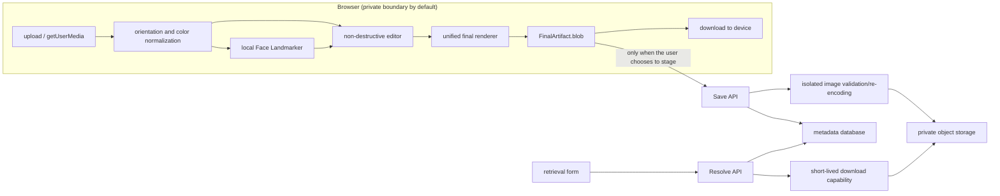

# Portrait Booth — SPEC

> Status: Draft v0.1
> Baseline date: 2026-08-05
> Related product document: [product.md](./product.md)
> Keywords: `MUST`, `SHOULD`, and `MAY` are to be interpreted as described in RFC 2119.

## 1. Scope and key decisions

This specification covers an account-free web app MVP: template selection,
photo upload, device camera, face-angle guidance, basic editing,
exact-size rendering, export, short-term server staging, retrieval with a
6-character uppercase-alphanumeric KEY, and template content management.

### 1.1 Draft implementation assumptions

- The user selects `country/region + document + submission channel`
  before capture; `applicant class` is added only when rules differ.
- Source images, camera video frames, face landmarks, and edit state exist
  only in browser memory by default.
- "Export" is fully client-side; only choosing "stage" uploads the final
  artifact to the server.
- The server stores only the final artifact - never source images,
  intermediate frames, face geometry, identity embeddings, or edit history.
- The staging TTL is fixed at 30 days (product-confirmed 2026-08-06,
  changed from the 24-hour baseline; see §1.2.1); the service-policy
  expected retention is shown, and the server-authoritative `expiresAt` is
  shown after saving.
- One KEY corresponds to exactly one final photo and must never be reused
  for another photo even after expiry or deletion.
- "One KEY, one photo" is interpreted by save record: the same idempotent
  request always returns the same KEY, and independently saving the same
  visual content may produce a new KEY; no content deduplication that would
  widen the privacy-processing scope is performed.
- Automatic checks are capture and composition assistance, not a government
  acceptance guarantee.

### 1.2 P0 security decision gate

The user-requirements baseline is "retrieve photos yourself with a KEY of
total length 6, each position `A–Z` or `0–9`", i.e. KEY-only. Letter and
digit counts are unrestricted and neither type is required. The 36-character
space is `36^6 = 2,176,782,336`, about 31.0 bits. A uniqueness constraint
solves generation collisions, but this still cannot alone provide the strong
authentication needed to protect portrait photos.

One of the two following strategies must be confirmed before
implementation:

| Strategy | Requirement compatibility | Security | Spec conclusion |
| --- | --- | --- | --- |
| `key_only_ephemeral` | Fully matches "enter only the KEY" | Relies on the 30-day TTL (§1.2.1), capacity caps, rate limiting, CAPTCHA (deferred), and monitoring; distributed enumeration residual risk remains | Selected by the §1.2.1 product decision; residual-risk acceptance recorded there |
| `key_plus_claim` | Keeps the 6-character KEY but requires a ≥128-bit access secret in a private link/QR for cross-device use | Recommended; the KEY is a locator and the access secret is the proof of access | Recommended secure variant, but a product-requirement deviation; must not be treated as adopted without confirmation |

The decision was made on 2026-08-06 in favor of `key_only_ephemeral`
(see §1.2.1). Both strategies must generate a separate delete secret. No
implementation may describe a KEY as an object-storage path, a public URL,
or a strong password.

#### 1.2.1 Decision record (2026-08-06, product-confirmed)

- **Strategy**: `key_only_ephemeral` is selected. The API, client, and
  data model implement this; the `key_plus_claim` branch is not
  implemented.
- **Staging TTL**: 30 days, changed from the §1.1 baseline of 24 hours.
  `service-policy` returns `temporaryStorageTtlSeconds = 2592000`.
- **Threat review**: the product permanently waives the formal threat-
  review process; it is no longer a Public Beta blocker. All low-cost
  engineering controls in §9.3 (rate limiting, failure thresholds, unified
  errors, budget auto-shutdown, no silent renewal, monitoring alerts)
  remain and are implemented; CAPTCHA is deferred as a later enhancement
  with the `captchaToken` field kept for interface compatibility.
- **Residual risk**: the residual distributed-enumeration risk under 30-day
  retention and larger capacity is accepted by the product as recorded
  here.

## 2. System boundaries



### 2.1 Logical components

- **Web Client**: template browsing, camera, upload decoding, pose
  analysis, editing, final rendering, and local download.
- **Template Service**: publishes the versioned template catalog and can
  take down expired templates; public read-only.
- **Save/Retrieve API**: accepts final photos, generates KEYs/credentials,
  resolves retrieval, deletion, and rate limiting.
- **Image Validator**: actually decodes and re-encodes server-staged images
  in an isolated, low-privilege, no-outbound-network environment.
- **Private Object Storage**: no public ACLs; short lifecycle; object names
  are unrelated to KEYs.
- **Metadata Store**: holds mappings, template versions, lifecycle, and
  digests, never image binaries.
- **Lifecycle Worker**: makes expired objects immediately inaccessible and
  completes physical deletion and audit within the SLO.

Frameworks, databases, and cloud vendors are not yet chosen; the first
implementation should prefer project conventions and existing dependencies,
avoiding a locked-in stack at this spec stage.

## 3. Pages and states

### 3.1 Suggested routes

| Route | Purpose | Notes |
| --- | --- | --- |
| `/` | Home, entry to create or retrieve | No camera permission requested |
| `/create` | Template, source, capture, edit, and completion wizard | Edit state is memory-only; prompt before refresh |
| `/retrieve` | KEY entry, access-proof redemption, and download; delete shown only when this browser separately holds the delete secret | KEY never enters URLs, query, or referrer; download credentials do not grant delete rights |
| `/privacy` | Concise and full privacy statement | No camera/analysis model needed |
| `/templates/:id` | Template rules, sources, and version history | Derived unofficial values are never presented as mandatory rules |

### 3.2 Client creation state machine

`template-selection → source-selection → permission/capture-or-upload → review → edit → validate → final-ready`

- Selecting a new source image clears the previous final Blob and
  analysis results.
- Switching templates must recompute crop, output size, and rule checks;
  incompatible transforms must not be silently carried over.
- `final-ready` holds one immutable `FinalArtifact`, the only shared state
  from which export or staging is allowed.
- Export and staging are non-exclusive side effects on that artifact, not
  new states replacing `final-ready`; the same artifact may be both
  exported and staged.
- Any source, template, or transform change destroys the old artifact and
  its check summary immediately and returns to `edit`/`validate`; the old
  Blob must not be reused for another operation.

### 3.3 Server photo state machine

`validating → active → access-revoked → purging → purged`

- Not retrievable before `active`.
- On reaching `expiresAt` or receiving a valid delete request, the photo
  enters `access-revoked` within a transaction and all download
  capabilities are revoked; synchronous authorization must not depend on
  whether the async cleanup task has run.
- Validation failures retain no photo bytes: the request ends after
  cleaning staging; only short-lived error categories without images may be
  kept for operations statistics.
- `access-revoked`, `purging`, `purged`, and nonexistent return identical
  results to retrievers; after `purged`, photo-associated metadata is
  deleted, keeping only the KEY registry entry without personal
  information.

## 4. Functional requirements

### 4.1 Template selection

| ID | Requirement | Acceptance summary |
| --- | --- | --- |
| TMP-001 | The system must first ask the user for country/region, document type, and submission channel; applicant class is asked only when rules differ by class (e.g. child/adult) | Paper and digital rules for the same country are selectable separately; when no difference exists the class is fixed to `all`, adding no meaningless step |
| TMP-002 | Every document template must show the official source, source update time (if any), this project's review date, status, and restrictions; unofficial generic portrait templates show the project-internal spec, version, and a "non-document template" marker | Users can open the official source before creating; generic templates must not masquerade as official rules; stale sources can be taken down |
| TMP-003 | `reference_only`/`unsupported` templates must not show "submittable artifact" or "compliant" | Restrictions such as Canada's selfie ban and UK online pre-cropping have prominent explanations |
| TMP-004 | Template updates must produce a new version; an open editing session stays pinned to the version at its start | Both final and staging records contain `templateId + templateVersion` |
| TMP-005 | No "generic Schengen 35×45 legal template" without an accepting-country context | The EU central rules page is only an entry; the user must choose the accepting member state/mission |

### 4.2 Upload

| ID | Requirement | Acceptance summary |
| --- | --- | --- |
| SRC-001 | The MVP client accepts actually decodable JPEG, PNG, WebP | The `accept` attribute is not a security check; wrong extensions/MIME cannot bypass actual decoding |
| SRC-002 | Default per-source-file caps: 15 MB, 24 MP, 8,000 px per edge; limits configurable and must be verified on tier-1 real mobile devices | Header dimensions are parsed before full decoding; working bitmaps are scaled under control to the template's needed resolution, with actionable errors over the limits |
| SRC-003 | Must normalize per EXIF orientation to actual pixel orientation | All EXIF orientations 1–8 have automated tests; edit coordinates do not depend on EXIF |
| SRC-004 | HEIC/HEIF may be an enhancement after capability detection, but is not part of the cross-browser MVP | When unsupported, conversion or camera use is clearly suggested, never a silent failure |
| SRC-005 | Selecting a local file must not auto-upload | Network checks prove the export path sends no photo content |

### 4.3 Camera and capture

| ID | Requirement | Acceptance summary |
| --- | --- | --- |
| CAM-001 | `getUserMedia` is called only after the user clicks "open camera", with `audio:false` | No permission prompt on initial load and no microphone request |
| CAM-002 | The camera must run in an HTTPS/secure context; permission denial, no device, device in use, and constraint failures all offer an upload fallback | No single error locks the creation flow |
| CAM-003 | First request uses `{audio:false, video:{facingMode:{ideal:'user'}, width:{ideal:1920}, height:{ideal:1080}}}` without `exact/min/max` | On failure the user may retry with `video:true`; unsatisfied ideal constraints must not be treated as a routine `OverconstrainedError` |
| CAM-004 | The preview may be CSS-mirrored, but analysis coordinates and the default artifact must be unmirrored true orientation | Front-camera export matches the source frame orientation; overlay x coordinates map correctly |
| CAM-005 | Each camera request uses an increasing generation/session token; leaving the step, accepting a photo, page-hidden timeout, or unmount stops all tracks, and a stale request succeeding late must immediately stop the tracks it returns | A browser permission Promise resolving after leaving does not bind video or leak tracks; UI cancellation only cancels the app session and does not claim to cancel the browser permission prompt |
| CAM-006 | `ImageCapture.takePhoto()` is only a high-resolution enhancement after capability detection; the baseline captures from the `<video>` intrinsic pixels to a Canvas | Capture still completes where Firefox/Safari lack ImageCapture |
| CAM-007 | Auto-capture must be user-enabled explicitly, keeping a manual shutter, countdown cancellation, and retake | Users are never forced to act within a time limit |
| CAM-008 | After authorization, devices can be enumerated and switched; old tracks stop before a new request, and CAM-005 tokens discard out-of-order results | Repeated front/rear switching shows no double streams, stale-frame jumps, or residual indicators |

### 4.4 Face-angle and quality guidance

MediaPipe Face Landmarker on-device is recommended; model and package
versions must be locked. Before adoption, the locked build's actual network
behavior must be audited: the official Tasks privacy notice states input
stays on-device, but the SDK may send performance/usage metrics. Prefer a
build verified not to exfiltrate telemetry; if vendor metrics exist, the
fields, processor, region, and legal basis must be disclosed with
applicable consent before model initialization, and a manual path that does
not load the model must exist.

The minimal configuration is pinned: `runningMode:'VIDEO'`,
`numFaces:2`, `outputFacialTransformationMatrixes:true`,
`outputFaceBlendshapes:false`; detection/presence/tracking confidence
thresholds are calibrated and released together with the model version.
With `numFaces>1`, built-in smoothing must not be relied on; the
application must perform primary-face association, temporal smoothing, and
hysteresis.

The main thread uses `requestVideoFrameCallback` (falling back to
`requestAnimationFrame`) to create transferable `ImageBitmap`s for new
frames; the Worker allows only one synchronous inference at a time, keeps at
most one latest pending frame, and `close()`s it immediately on
replacement or completion. `detectForVideo(frame, timestampMs)` uses
monotonically increasing millisecond timestamps, and results carry
session/frame IDs; stale-session results must be dropped. Leaving the step
closes the bitmap, Landmarker, and Worker.

| ID | Requirement | Acceptance summary |
| --- | --- | --- |
| GDE-001 | Real-time status covers at least: no face, multiple faces, position/size, yaw, pitch, roll, stable, shootable | Every status has text and graphics, not color alone |
| GDE-002 | Guidance is expressed in the user's body direction, e.g. "turn your face slightly to your own left", never vague "screen left" | Both mirrored and unmirrored preview tests give the correct direction |
| GDE-003 | Pose values may be derived from the facial transformation matrix, but matrix layout, axes, and signs must be calibrated with fixed samples | Frontal, left/right turn, up/down tilt, and left/right lean samples all pass |
| GDE-004 | Initial engineering thresholds: `abs(yaw)≤7°`, `abs(pitch)≤7°`, `abs(roll)≤5°`, stable ≥800 ms; thresholds must be configurable | UI labels them capture heuristics, never official statutory tolerances |
| GDE-005 | After auto or manual capture of a fixed exact Blob/Bitmap, a static recheck must run again, never using stale results from countdown start or the last preview inference | A person moving during the countdown does not save an old "passed" state; the rechecked object matches the pixels entering the editor |
| GDE-006 | Model failure, low confidence, or insufficient performance only disables automatic guidance, never blocks manual capture/upload/edit/export | Degraded-path tests without WebGL/WASM/Worker complete the full flow |
| GDE-007 | Face landmarks, matrices, angles, and analysis frames must not be persisted, uploaded, or written to telemetry | Network, log, IndexedDB/localStorage checks find no such data |
| GDE-008 | Items the model cannot reliably determine - crown, top of hair, background, glare - must be marked manual confirmation or not checked | The check summary distinguishes `pass/warn/fail/unknown/manual` (manual = template items a machine cannot judge and that need human confirmation) |
| GDE-009 | Uploaded photos must also get one static position and yaw/pitch/roll analysis; a retake is suggested when cropping cannot fix it | A fixed upload sample yields angle conclusions consistent with the same captured frame, while the user can still continue manually |
| GDE-010 | Explainable exposure-clip and sharpness checks run on the actual captured/uploaded static image; metrics, normalization size, and thresholds ship with a quality-config version, and only `warn/unknown` without official basis | Fixed underexposed, overexposed, motion-blurred, out-of-focus, and normal licensed samples classify stably; no fabricated "pass" without a face/low confidence |

To prevent guidance flicker, smoothing, enter/exit hysteresis, and state
priorities should be used; status updates target 8–15 FPS, and the render
thread must not block editing controls on inference.

`QualityConfig` pins at least: version, face-ROI/whole-image fallback
strategy, luminance color space, dark/bright clip pixel thresholds and
ratios, sharpness operator, normalization to a 512 px long edge, numeric
thresholds, and test-set version. With any value empty, quality hints must
not be enabled; first-version values must be calibrated on the §12.3 fixed
samples and trigger only warnings - never an unexplainable "pass" after
device adaptation.

### 4.5 Editor

| ID | Requirement | Acceptance summary |
| --- | --- | --- |
| EDT-001 | Editing must be non-destructive, storing only transform parameters without repeatedly resampling the source | Multiple edits render only once at final state |
| EDT-002 | Drag, zoom, fine rotation, 90° rotation, horizontal mirror, undo, redo, and reset | Mouse, touch, and keyboard paths all complete |
| EDT-003 | The crop frame locks to the template's mandated output ratio; the source must cover the whole output canvas | No transparent/blank edges into official template output |
| EDT-004 | The zoom floor is exactly-covering the crop; the ceiling is bounded by available pixel quality and interaction limits | A cannot-be-ignored warning shows below the template's minimum pixels |
| EDT-005 | Template policy can disable or warn on mirror, background handling, retouch, and rotation | UK paper templates forbid mirroring; front-camera preview mirroring is not user editing |
| EDT-006 | "Rotating the photo to fix a tilted face" must not be treated as a pose-compliance fix | roll detection is based on the original face pose; rotation only corrects scan/camera canvas orientation |
| EDT-007 | Drag and two-finger gestures must have button, slider, or numeric-input alternatives | Satisfies WCAG 2.2 Dragging Movements and keyboard requirements |
| EDT-008 | The editor must show the template mask, head-top/chin or eye-line allowed ranges, and their meaning | Users can still align manually when automatic landmarks are unreliable |
| EDT-009 | Final checks must detect crop-area alpha; official templates forbidding background handling reject any transparent pixel, and compositing to a specified sRGB background is allowed only when the template explicitly permits it | PNG-to-JPEG never silently yields black or unexpected backgrounds; compositing enters the transform/check summary |

#### 4.5.1 Transform model

The normalized source-image coordinate origin is the top-left corner;
the final state saves the following parameters:

```ts
type EditTransform = {
  translateX: number; // normalized to the output width
  translateY: number; // normalized to the output height
  scale: number;      // multiplier relative to "exactly cover", >= 1
  rotationDeg: number;
  flipX: boolean;
};
```

Rendering must map orientation-normalized source pixels to the output
canvas with the same affine matrix; the matrix convention is fixed as
column vectors, CSS-pixel center coordinates, composed as
`cover → scale → flipX → rotation → translation`, and sampling beyond the
source boundary fails validation. Preview and export share the math
implementation. Floating-point parameters must not drift through
accumulated edits; undo records parameter snapshots, never resampled
bitmaps; golden vectors cover the four corners, center, 90° rotation,
mirror, and combined transforms.

### 4.6 Final checks and export

| ID | Requirement | Acceptance summary |
| --- | --- | --- |
| OUT-001 | One render produces an immutable `FinalArtifact` with an sRGB JPEG `blob` and an in-memory render manifest; export uses that Blob and staging uploads the same Blob | The two branches' upload/download input bytes are identical; after secure server re-encoding the retrieved image may differ in bytes, but pixel size, orientation, and composition must be semantically equivalent |
| OUT-002 | Exact-pixel templates must output exactly the same width, height, format, color space, and file-size constraints | Finland 500×653 and US DV 600×600 tolerate no 1 px deviation |
| OUT-003 | JPEGs with a max file size use bounded quality search; mandated pixels must never change to fit the size | Unsatisfiable cases error clearly with a source-image suggestion, never an out-of-spec file |
| OUT-004 | Output must strip EXIF/GPS/embedded thumbnails and unknown metadata, with orientation written into actual pixels | Metadata-scan and rotation regression tests pass |
| OUT-005 | MVP `FinalArtifact.blob`, local export, and server staging are unified as JPEG/sRGB; other output formats are later capabilities | US visa digital satisfies JPEG, 24-bit sRGB; Save API and export MIME do not conflict |
| OUT-006 | A physical-size template claiming "printable at actual size" must write the correct PPI with a locked-version deterministic encoder, generate pixels by `round(mm / 25.4 * ppi)`, and pass calibrated printing; otherwise it may only be labeled a reference image | Native Canvas `toBlob` often writes 96 dpi; size, color, and density metadata are re-parsed after encoding, and without passing it must not be marked print-ready |
| OUT-009 | `ranged_pixels` templates let the user choose the output size; candidates must fall inside the template min/max and match the aspect, strictly using `allowedSizes` when present; the choice flows through editor canvas, final render, check summary, and server validation | us-visa-digital defaults to 600×600 with 1200×1200 optional; the server returns `PHOTO_SIZE_MISMATCH` for out-of-range/broken-aspect sizes, runs OUT-003 search for in-range-but-oversized artifacts, and only `PHOTO_TOO_LARGE` when the floor is still exceeded |
| OUT-007 | The final page must show output pixels, physical size (if any), format, byte count, template version, warnings, and unchecked items | Key risks are visible before download without reading hidden notes |
| OUT-008 | Output filenames must not contain names or KEYs; recommended `{country}-{document}-{channel}-{yyyyMMdd}.jpg` | Filenames expose no portrait identity or access credentials |

```ts
interface FinalArtifact {
  artifactId: string; // random in-session ID generated per re-render
  blob: Blob;         // image/jpeg, immutable after creation
  manifest: {
    schemaVersion: 1;
    templateId: string;
    templateVersion: number;
    widthPx: number;
    heightPx: number;
    mime: "image/jpeg";
    orientationNormalized: true;
    matrix: [number, number, number, number, number, number];
    flipX: boolean;
  };
}
```

The manifest exists only in browser memory for preview consistency,
invalidity determination, and E2E tests; the MVP never uploads or persists
the manifest, source digests, transform digests, or plain content hashes.
The server validates only the uploaded artifact's observable size, encoding,
orientation, and file limits against the pinned template version, never
accepting client claims as proof.

### 4.7 Staging, KEY, and retrieval

| ID | Requirement | Acceptance summary |
| --- | --- | --- |
| SAV-001 | Before choosing to stage, the upload of the final photo, save purpose, authoritative retention, and expected expiry must be shown with explicit confirmation; after a successful save the server `expiresAt` is shown | An export-only flow never triggers the confirmation or network upload; the client never claims to know the precise absolute expiry before creation |
| SAV-002 | The server must actually decode, bound resources, and re-encode the final file; trusting client fields alone is not allowed | Fake MIME, scripts, polyglots, oversized pixels, and truncated files are rejected |
| SAV-003 | KEYs are generated with a CSPRNG from the fixed charset `ABCDEFGHIJKLMNOPQRSTUVWXYZ0123456789` without modulo bias and are unique in the database; each position is drawn independently with no letter/digit quota, resampling on collision | Injectable-RNG boundary vectors prove rejection sampling; all-letter, all-digit, and any mixed results are valid; concurrent generation produces no duplicate mappings; randomness statistics are only an offline health check |
| SAV-004 | KEYs are handled as strings; input strips spaces/ASCII hyphens and uppercases ASCII letters, then must match `^[A-Z0-9]{6}$`; display may group as `A7C 2F9` with the canonical value `A7C2F9` | Leading `0`s are kept; phone copy, paste, manual entry, and lowercase all normalize correctly; non-ASCII characters and similar glyphs are never silently mapped |
| SAV-005 | KEYs are never reused; a single Key Registry keeps personal-information-free keyed-HMAC entries after photo deletion | An old KEY never shows another person's photo in the future; allocation and mapping happen in one transaction |
| SAV-006 | A save simultaneously generates a separate ≥128-bit delete secret; `key_plus_claim` additionally generates a ≥128-bit access secret | The database stores only versioned verification digests; the raw secrets are replayable only within the same anonymous session's encrypted idempotency-response window of at most 10 minutes |
| SAV-007 | Retrieval uses POST bodies/secure cookies, never putting KEYs or long-lived secrets in URLs/query | Proxies, browser history, referrer, and default logs contain no credentials |
| SAV-008 | Invalid, expired, deleted, and unauthorized return the same external status/copy with similar processing time | Automated differential tests stay within preset tolerance |
| SAV-009 | After successful verification, only a short-lived, single-use download capability is issued; download responses carry `Cache-Control:no-store` | The capability is not replayable after expiry or use |
| SAV-010 | A user can revoke a photo immediately only with the separate delete secret obtained at creation; the delete entry shows only while the current browser still holds the delete secret | KEYs, access secrets, or download sessions alone cannot delete; all download capabilities die after deletion |
| SAV-011 | At expiry, reads are synchronously denied; minute-level lifecycle tasks delete all versions, primary copies, and temporary files of the primary object within 60 minutes | The purge backlog and oldest age are continuously monitored and alerted before the SLO; the daily canary is supplementary verification only |
| SAV-012 | The same anonymous save session, the same ≥128-bit `Idempotency-Key`, and the same request digest must return the same save record and KEY | Retries do not create a second KEY; the same idempotency key with a different payload returns 409; independent saves may produce different KEYs |

## 5. Template data model

### 5.1 Minimal schema

```ts
type RuleEnforcement = "mandatory" | "recommended";
type RuleProvenance = "source_literal" | "derived" | "portal_verified";
type TemplateStatus = "draft" | "active" | "reference_only" | "deprecated" | "unsupported";
type RuleUnit = "mm" | "px" | "ratio" | "degree";
type EditPolicy = "allowed" | "warn" | "forbidden";

type OutputProfile =
  | {
      kind: "exact_pixels";
      widthPx: number;
      heightPx: number;
      aspect: { width: number; height: number; enforcement: RuleEnforcement; provenance: RuleProvenance };
    }
  | {
      kind: "ranged_pixels";
      minWidthPx: number;
      minHeightPx: number;
      maxWidthPx: number;
      maxHeightPx: number;
      defaultWidthPx: number;
      defaultHeightPx: number;
      aspect: { width: number; height: number; enforcement: RuleEnforcement; provenance: RuleProvenance };
      allowedSizes?: Array<{ widthPx: number; heightPx: number }>;
    }
  | {
      kind: "physical_raster";
      widthMm: number;
      heightMm: number;
      printPpi: number;
      rounding: "nearest";
      widthPx: number;
      heightPx: number;
      pixelDerivation: "round(mm / 25.4 * printPpi)";
      ppiProvenance: RuleProvenance;
      calibrationProfileId: string;
    }
  | {
      kind: "portal_source";
      minWidthPx?: number;
      minHeightPx?: number;
      maxWidthPx?: number;
      maxHeightPx?: number;
      aspect?: { width: number; height: number; enforcement: RuleEnforcement; provenance: RuleProvenance };
      officialPortalPerformsCrop: boolean;
    }
  | {
      kind: "guidance_only";
      reason: string;
    };

interface SourceReference {
  id: string;
  url: string;
  title: string;
  authority: string;
  sourceUpdatedAt?: string;
  accessedAt: string;
}

interface MeasurementRule {
  id: string;
  metric:
    | "head_height"
    | "head_top_margin"
    | "chin_bottom_margin"
    | "eye_line_from_bottom"
    | "face_width"
    | "interpupil_distance"
    | "face_left_margin"
    | "face_right_margin"
    | "face_center_offset_x"
    | "yaw"
    | "pitch"
    | "roll";
  min?: number;
  max?: number;
  target?: number;
  tolerance?: number;
  unit: RuleUnit;
  ratioDenominator?: "canvas_width" | "canvas_height";
  anchors: string[];
  axis: "x" | "y" | "angle";
  bounds: "inclusive";
  appliesToOutputSize?: { widthPx: number; heightPx: number };
  coordinateSpace:
    | "output_physical_mm_top_left"
    | "output_pixel_top_left"
    | "output_normalized_top_left"
    | "pose_camera_degrees";
  evaluation: "automatic" | "manual" | "automatic_with_manual_confirmation";
  enforcement: RuleEnforcement;
  provenance: RuleProvenance;
  sourceRefs: string[];
  sourceLiteral?: string;
}

interface CaptureRule {
  id: string;
  check:
    | "single_face"
    | "front_facing"
    | "neutral_expression"
    | "eyes_visible"
    | "mouth_closed"
    | "background"
    | "lighting"
    | "glasses"
    | "head_covering";
  expected: boolean | string | number;
  evaluation: "automatic" | "manual" | "automatic_with_manual_confirmation";
  enforcement: RuleEnforcement;
  provenance: RuleProvenance;
  sourceRefs: string[];
  sourceLiteral?: string;
}

interface TemplateRevision {
  revisionId: string;          // globally unique; suggested `${id}@${version}`
  id: string;
  version: number;
  schemaVersion: number;
  contentHash: string;
  label: Record<string, string>;
  jurisdiction: string;
  documentType: "passport" | "visa" | "id" | "permit" | "portrait";
  submissionChannel: "paper" | "digital_upload" | "certified_transfer" | "onsite_capture";
  applicantClass: "adult" | "child" | "infant" | "all";
  applicationPost?: string;
  applicantNationalityScope?: string[];
  residenceScope?: string[];
  visaPurposeScope?: string[];
  validFrom?: string;
  validUntil?: string;
  sources: SourceReference[];
  output: OutputProfile;
  outputFile?: {
    mime: Array<"image/jpeg">;
    sizeLimit?: {
      minBytes?: number;
      maxBytes?: number;
      sourceLiteral: string;
      normalization: "source_exact" | "conservative_derived" | "portal_verified" | "unresolved";
    };
    colorSpace?: "sRGB";
    bitsPerChannel?: 8;
    channels?: 3;
    maxCompressionRatio?: number;
  };
  portalInputFile?: {
    mime: string[];
    sizeLimit?: {
      minBytes?: number;
      maxBytes?: number;
      sourceLiteral: string;
      normalization: "source_exact" | "conservative_derived" | "portal_verified" | "unresolved";
    };
  };
  cropRules: MeasurementRule[];
  captureRules: CaptureRule[];
  overlay: {
    kind: "none" | "oval" | "crown_chin_bands" | "eye_band" | "combined";
    ruleIds: string[];
  };
  capabilities: {
    selfCapture: "allowed" | "not_confirmed" | "forbidden" | "certified_only";
    crop: EditPolicy;
    rotate: EditPolicy;
    mirror: EditPolicy;
    retouch: EditPolicy;
    backgroundReplace: EditPolicy;
    requiresOriginalCameraFile: boolean;
    requiresProfessionalPhotographer: boolean;
  };
  sourceNotes: Record<string, string[]>;
}

interface TemplatePublication {
  revisionId: string;
  contentHash: string;
  status: TemplateStatus;
  statusReason: string;
  owner: string;
  reviewer: string;
  verifiedAt: string;
  reviewDueAt: string;
  effectiveAt: string;
  publicationRevision: number;
}
```

`TemplateRevision` content is immutable and `revisionId` is globally
unique; `TemplatePublication` references the revision precisely via
`revisionId + contentHash`, with only the publication status mutable.
Emergency takedown updates only the publication and never rewrites
historical rules. A template `id` must encode `jurisdiction +
documentType + submissionChannel + applicantClass`; when a mission/
accepting post changes rules, `applicationPost` must also be encoded, and
visa rules affected by nationality, residence, or purpose extend the
corresponding dimensions further. The server rejects schema-combination
errors with versioned JSON Schemas.

All sizes are written uniformly as **width×height**. `active` templates
must not use `portal_source` or `guidance_only`, must have `outputFile`,
and may only produce the MVP-supported JPEG; the former describes only
input for an official portal to crop itself, the latter only guides rule
selection, and both stay `reference_only`. A rule's `enforcement` is
separate from its evidence `provenance`; all derived ratios, PPI-converted
pixels, and the like are marked `derived` and must not pose as official
source text. When a source states `KB/K/MB` without declaring decimal or
binary, `sizeLimit.sourceLiteral` must be kept; `active` templates need
portal-measured or recorded-more-conservative byte thresholds, and
`unresolved` must never activate. Every rule points to concrete sources via
`sourceRefs`, and masks may only reference rules with clear anchors, axes,
unit-compatible coordinate spaces, and boundary semantics.

### 5.2 Initial template candidates

The table below is the research seed as of 2026-08-05 and is not the
entire launch set; document templates still need content-maintainer review
of the official pages before becoming `active`, while the generic portrait
is reviewed against the project-internal spec and test archive.

| Template ID (suggested) | Canvas/file | Composition | Publication policy |
| --- | --- | --- | --- |
| `generic-portrait-square` | exactly 1200×1200 px JPEG; unofficial template | Free composition by the user | Mirror allowed; must be prominently labeled "generic portrait, non-document-compliance template" |
| `us-passport-paper` | 2×2 in (50.8×50.8 mm; official pages often approximate 51×51 mm); exactly 600×600 px at the product's chosen 300 ppi | chin to top of head 25–35 mm; the anchor keeps the official `top of head` wording, not reinterpreted as crown/hair | May be taken by a friend or family member; handheld selfies or single-person auto-shutter shots must not be claimed as officially endorsed; AI, background replacement, filters, or appearance alteration forbidden; 300 ppi is `derived`, must pass calibrated printing |
| `us-passport-online-source` | JPG/JPEG/PNG/HEIC/HEIF; 54 KB–10 MB; no fixed public pixels/ratio | original head-and-shoulders digital photo, cropped by the official portal | `reference_only/portal_source`; must not be fitted with the paper square template |
| `us-visa-paper` | 51×51 mm | chin to top of head including hair 25–35 mm; eye line 28–35 mm from the bottom | `reference_only`; must be confirmed per visa form/category and accepting post, never a context-free generic artifact |
| `us-visa-digital` | 600–1200 px square; default 600×600; JPEG, 24-bit sRGB, ≤240 KB, compression ratio ≤20:1 | chin to top of head including hair 50%–69% of image height; eye line 56%–69% from the bottom | Covers only the applicable DS-160/DS-1648 digital uploads; does not cover DS-260, DV, or mission-specific requirements; the active threshold uses ≤240,000 bytes `conservative_derived`, updatable after portal verification |
| `us-dv-digital-{program-year}` | exactly 600×600 px; JPEG, ≤240 KB | chin to top of head including hair 50%–69% of image height; eye line 56%–69% from the bottom | Activates only when the specific program-year instructions and applicable application window are formally published; ≤240,000 bytes starts as `conservative_derived` and is not merged with the ordinary visa-scope template |
| `uk-passport-paper` | 35×45 mm | chin to the anatomical crown 29–34 mm | `reference_only`; official rules forbid cropping from a larger image and software modification; within the last month, professional-quality printing; mirroring is usually challenged/rejected, with possible exceptions after a reviewer confirms the true appearance |
| `uk-passport-online-source` | min 600×750 px; 50 KB–10 MB; no fixed public ratio | keep head, shoulders, upper body | `reference_only/portal_source`; official rules say do not pre-crop |
| `ca-passport-paper` | 50×70 mm | chin to the anatomical crown 31–36 mm | `reference_only`; must be a commercial photographer, professional printing, no modification |
| `ca-passport-online` | 1200×1800 to 3000×4500 px; aspect 2:3 (source text says 3:2 portrait); JPEG; 200 KB–5 MB | head height 45%–50% | `reference_only`; only eligible online renewals, must be the original camera file saved directly by the commercial photographer; colour or black and white, with cropping, brightness/contrast/sharpening, and background-replacement modification forbidden |
| `fi-police-paper` | 36×47 mm; colour or black and white | crown point without hair/beard to chin tip 32–36 mm; crown point to top edge 4–6 mm; chin tip to bottom edge 7–9 mm; face centre line deviates from the photo centre line ≤1.5 mm | Paper photos are submitted only at police service points; processing that changes appearance details or raises authenticity doubts is forbidden; must not be reused as the colour-requiring Finnish visa template |
| `fi-police-digital` | exactly 500×653 px; JPEG; source text ≤250 KB; active threshold ≤250,000 bytes `conservative_derived`; sRGB, if adopted, must be marked derived | crown point to chin tip 445–500 px; crown point to top edge 56–84 px; chin tip to bottom edge 96–124 px; face centre line deviates from the photo centre line ≤21 px | Users may upload to the police photo server themselves or use a studio flow, but this product cannot submit on their behalf and does not conflate the two KEY types; processing that changes appearance details or raises authenticity doubts is forbidden |
| `cn-passport-paper-{post}` | candidate source 33×48 mm | candidate-source face width 15–22 mm; head height 28–33 mm; top 3–5 mm; bottom ≥7 mm | `reference_only`; must bind the concrete overseas mission/issuing post and source version; must not be called a China-wide rule |
| `cn-visa-paper-{post}` | candidate source 33×48 mm | head-width and other differences exist between missions | `reference_only`; may activate only after binding the accepting post, nationality/residence, and visa purpose |
| `cn-visa-digital-{post}` | source allows 354×472 to 420×560 px; the first active revision is pinned at 354×472; JPEG, 24-bit RGB; "generally 40K–120K bytes" is not an unconditional hard threshold | 354×472 only: face width 191–219 px, hairline to top edge 10–70 px, eye line ≥256 px from the bottom, interpupillary distance >60 px; front-facing target 0°, the source's max yaw ≤20° and pitch ≤25° are ceilings, not targets | Size-specific rules must write `appliesToOutputSize`; 3:4 is derived from the endpoints; activates only after binding the mission/source version and verifying against the actual portal |
| `jp-passport-paper` | 35×45 mm; 413×531 px at the product's chosen 300 ppi | head height 34±2 mm; top 4±2 mm; bottom 7±2 mm; horizontal centre 17±2 mm; ≥2 mm from the face to each side edge | plain background without patterns/shadows, white recommended; within the last 6 months; horizontal mirroring and appearance-altering retouching forbidden; 300 ppi is `derived`, must pass calibrated printing |
| `jp-passport-online-domestic-source` | JPG ≤600 KB; no public fixed pixels | passport composition still required | `reference_only/portal_source`; must not merge with the overseas channel |
| `jp-passport-online-overseas-source` | JPG/JPEG/BMP/PNG, 20 KB–2 MB; no public fixed pixels | passport composition still required | `reference_only/portal_source`; third-party pixels must not be hard-coded |
| `jp-visa-paper-{post}` | central table lists 35×45 mm (width×height) and separately 1.4×2 in; the two are not equivalent | the central table has no uniform head height | `reference_only`; must be reviewed per nationality, residence, purpose, and accepting post; no single size may pose as the central unique rule |
| `in-passport-overseas-digital` | 630×810 px, colour, ≤250 KB; 7:9 is derived | face 80%–85% | `reference_only`; overseas Passport Seva requires a white background and no software modification, so this app's re-encoded files cannot claim applicability |
| `in-regular-visa-digital` | the old upload-guide PDF lists 350×350 to 1000×1000 px squares, JPEG, 10–300 KB; the current HTML lists no pixel range | the HTML expresses head height 25–35 mm physically, with no digital-image PPI to convert pixels directly | `reference_only`; the pixel range is marked `legacy_pdf_only/unverified`, not a mandatory rule until the current portal is measured, with composition staying unresolved |
| `in-evisa-digital` | square; JPEG, 10 KB–1 MB; the current page has no fixed pixels | head centred, full head, facing forward, eyes open | white/light plain background without shadows, no borders, no glasses; separate from the regular visa |
| `schengen-short-stay-selector` | the Schengen central level has no single fixed W×H canvas; the common guidance is 35–40 mm wide | within the last 6 months, face 70%–80% of the height; specifics decided by the accepting country/mission | `reference_only/guidance_only` selection entry; not a crop portal and must not output a "generic Schengen artifact" |

The Public Beta hard-minimum release manifest is: `generic-portrait-square`,
adult `us-passport-paper`, adult `us-visa-digital`, adult
`fi-police-digital`, adult `cn-visa-digital-{post}` reviewed for the
concrete mission, and adult `jp-passport-paper`. The table IDs are template
family names; the actual `id/revisionId` must encode `applicantClass`;
child/infant stays reference until separately reviewed and tested. DV joins
the current manifest only when the specific program year and application
window are formally published - not an unconditional gate. US and Japan
paper templates may become `active` only after the table's PPI/pixel
encoding and calibrated printing pass; UK, Canada, and Schengen stay
reference/guidance. Any hard-minimum failure blocks Public Beta; shrinking
the set is an explicit product change that must update PRODUCT, SPEC, and
the release manifest together, never silently waived at release review.

### 5.3 Template governance

- Every `active` document template must have one content maintainer and
  at least one official government/international-organization source.
  Unofficial generic templates with `documentType:"portrait"` may use a
  versioned project-internal spec, owner, and test archive instead, but
  must permanently display "non-document template" and inherit no official
  compliance wording.
- When automated link checks fail, `validUntil` expires, or the review SLA
  is exceeded, `TemplatePublication` must be updated to `reference_only` or
  stricter - never rewriting `TemplateRevision` or continuing silent
  publication.
- The review SLA is suggested at every 90 days; high-volatility channels
  may be shorter.
- Rule changes must not overwrite old versions; server staging records must
  be able to explain which historical version they used.
- Template response caching must have a max TTL, mandatory ETag
  revalidation, and an emergency-takedown signal; before export/staging,
  re-confirm the pinned version was not revoked for security or rule
  reasons.
- Internal contradictions in official pages must be recorded. For example,
  as of the review date some US overview pages still write 1 inch as
  22 mm while the official composition page and the math give 25 mm; the
  template uses 25–35 mm and leaves a trace in `sourceNotes`.

## 6. Draft API contract

All endpoints use HTTPS with a default `Content-Type:
application/json`; image uploads use `multipart/form-data`. Error
`requestId`s may be logged; credentials and photo content may not. Save,
resolve, download, delete, and their success/error responses must all send
`Cache-Control: no-store, private`, and CDN, reverse-proxy, and Service
Worker caching is forbidden.

### 6.0 Fetch the current service policy

```http
GET /api/v1/service-policy
```

The response includes the confirmed `temporaryStorageTtlSeconds` (30 days;
see §1.2.1), the current `retrievalMode` (`key_only_ephemeral`), the max
upload limit, and the policy version. The staging confirmation page shows
the expected expiry from it; the `expiresAt` in a successful save response
is the authoritative time. Clients must not submit or extend retention.

After save confirmation and before upload, an anonymous recoverable
session is created first:

```http
POST /api/v1/save-sessions
```

Success returns `204` and sets a random Cookie of at least 128 bits:
`Secure; HttpOnly; SameSite=Strict; Path=/api/v1/saves; Max-Age=600`. Only
after receiving this response does the client generate the
`Idempotency-Key` and upload, so even if the save response is lost,
subsequent retries still hold the original session. The session endpoint
checks Origin/Fetch Metadata, accepts no session identifier in URLs, and
logs neither cookies nor idempotency keys.

### 6.1 Fetch templates

```http
GET /api/v1/templates?jurisdiction=FI&documentType=passport&channel=digital_upload&applicantClass=adult
If-None-Match: "catalog-version"
```

`applicantClass=adult` first matches the exact class, then allows `all`
as the fallback when no class difference exists; duplicate or
contradictory results are content-publishing errors. The catalog response
includes the schema/catalog version, `TemplateRevision`,
`TemplatePublication`, and sources, and supports `ETag`. Pinned versions
have an additional exact endpoint:

```http
GET /api/v1/templates/{templateId}/versions/{version}
```

Client terminal state uses the actually selected immutable version and
does not drift with background catalog updates; but the publication must be
re-fetched before export/staging. Versions `deprecated/unsupported` for
security or rule reasons must block new terminal operations and return
`TEMPLATE_UNAVAILABLE`; ordinary new catalog versions do not affect a
pinned version that is still `active`.

### 6.2 Stage an artifact

```http
POST /api/v1/saves
Content-Type: multipart/form-data
Idempotency-Key: <client-random-128-bit-or-more>

photo=<final-artifact-jpeg>
templateId=fi-police-digital
templateVersion=3
```

Recommended response:

```json
{
  "key": "A7C2F9",
  "keyDisplay": "A7C 2F9",
  "retrievalMode": "selected-policy-value",
  "claimSecret": "present-only-for-key-plus-claim",
  "deleteSecret": "base64url-independent-128-bit-or-more",
  "expiresAt": "2026-08-06T12:34:56Z",
  "template": { "id": "fi-police-digital", "version": 3 },
  "photo": { "width": 500, "height": 653, "mime": "image/jpeg" }
}
```

- `retrievalMode` can only be the server policy that completed the P0
  decision; the client cannot choose or downgrade it.
- Template fields and file declarations are untrusted input; the server
  reads the immutable template version and current publication, verifies
  observable fields independently, and expiry is decided solely by the
  server policy.
- A random anonymous save-session Cookie must be established via
  `/save-sessions` before upload. The raw secrets live only within that
  session's encrypted response envelope for the 10-minute idempotency
  window; the backend stores digests long-term.
- While streaming and validating multipart fields, the server computes a
  versioned, domain-isolated HMAC request digest: input is the
  length-prefixed `save-v1 + photo bytes + normalized templateId +
  templateVersion`, excluding the random multipart boundary, field order,
  filename, or client MIME. A browser rebuilding the multipart thus gets
  the same digest, without leaving a plain content hash. The same save
  session, same `Idempotency-Key`, and same request digest replay the same
  response within the window; concurrent duplicate requests allow only one
  creation transaction. The same idempotency key with a different payload
  returns 409; knowing only the idempotency key without the save-session
  Cookie must not recover secrets. Idempotency keys and envelopes never
  enter logs.
- `key_only_ephemeral` responses return no `claimSecret` but must enable
  section 9's additional controls.
- The save endpoint accepts only canonical final JPEGs; client source
  formats do not affect the server whitelist.
- The contract is synchronous: `201 Created` returns only after the image
  is validated, re-encoded, written to private object storage, and the
  record enters `active`. A client cancelling fetch only stops its local
  wait and does not promise server cancellation; after a timeout, the same
  idempotent request must be retried. Failed or orphaned staging is
  cleaned per §8.2.
- The atomic commit boundary is fixed: first write the validated artifact
  under a random private object name (still staging), then generate the
  KEY/secret and the encrypted response; then, in one database
  transaction, complete `KeyRegistry` reserve/activate, `PhotoRecord(active)`,
  and `SaveIdempotencyRecord(completed + encryptedResponseEnvelope)`. Only
  after the transaction commits does the object become the reachable
  terminal state and the response return. A pre-commit crash leaves only
  database-unreferenced objects cleared by the 15-minute orphan sweep; a
  post-commit envelope is necessarily replayable - no "photo active but
  credential unrecoverable" intermediate state exists.

### 6.3 Resolve retrieval

```http
POST /api/v1/retrievals/resolve
Content-Type: application/json

// key_only_ephemeral
{"key":"A7C 2F9","captchaToken":"challenge-when-required"}

// key_plus_claim
{"key":"A7C 2F9","claimSecret":"base64url-secret","captchaToken":"challenge-when-required"}
```

The server first finds the record's fixed `retrievalMode` by KEY and
enforces it; degraded requests missing the access secret are never
accepted. Until confirmed, both contracts are conditional drafts and do
not mean `key_plus_claim` is product-adopted.

If `key_plus_claim` is ultimately chosen, the P0 share package must carry
both the KEY and the claim. Manual dual fields, a QR, or a fragment link
like `/retrieve#v1.<base64url-package>` are acceptable; the fragment never
reaches the server, and the client must parse it before loading any
non-essential resources, clear it immediately with `history.replaceState`,
and redeem it via a POST body. That page forbids third-party scripts,
analytics, session replay, and Service Worker caching; delete secrets must
never go into an ordinary pickup share package.

Success returns only a non-sensitive summary and an opaque download
token generated by a CSPRNG with at least 128 bits, a 60-second lifetime,
and single use. The server stores the token digest bound to `photoId +
purpose + expiresAt + revocationEpoch`; download consumes it with a
cross-instance atomic operation while re-checking the photo is still
`active` and unexpired. It must not be converted to a directly signed
object-storage presigned URL that cannot be revoked instantly. Download
returns a Blob via a POST/fetch with an Authorization header, keeping
long-lived secrets out of URLs:

```http
POST /api/v1/retrievals/download
Authorization: Bearer <one-time-download-token>
```

The response headers include at least:

```http
Content-Type: image/jpeg
Content-Disposition: attachment; filename="portrait-photo.jpg"
Cache-Control: no-store, private
Referrer-Policy: no-referrer
X-Content-Type-Options: nosniff
X-Robots-Tag: noindex, nofollow, noarchive
```

### 6.4 Delete

```http
DELETE /api/v1/saves
Content-Type: application/json

{ "key": "A7C 2F9", "deleteSecret": "base64url-independent-secret" }
```

Deletion must be idempotent; `key` only addresses and `deleteSecret`
authorizes. In one transaction the server marks the photo
`access-revoked`, increments `revocationEpoch`, and revokes all download
capabilities, then deletes physically asynchronously; whether the object
existed before is never disclosed.

Download/retrieval sessions do not automatically grant delete rights.
This endpoint is callable only while the current browser holds the
separate delete secret from creation; KEYs, access secrets, and download
tokens cannot substitute for the delete secret.

After closing the page, the delete secret cannot be recovered by the
service; the save-success page must let the user copy or download the
delete receipt and explain the consequences. Manual data-subject requests
under applicable privacy law are a separate, verifiable support process
and cannot substitute guessed KEYs for identity verification.

### 6.5 Unified errors

```json
{
  "error": {
    "code": "PHOTO_UNAVAILABLE",
    "message": "photo unavailable; the KEY/access credential may be invalid, expired, or deleted.",
    "requestId": "opaque-id"
  }
}
```

`POST /retrievals/resolve` returns HTTP `404` with the `PHOTO_UNAVAILABLE`
above for a missing KEY, wrong claim, expired, deleted, or inactive photo;
`DELETE /saves` returns `204` for all of these. Public interfaces must not
distinguish reasons with different copy or status. In controlled load
tests, at least 1,000 requests per category, median and p95 end-to-end
latency differences must both stay within 25 ms or 10% of the shared
baseline (whichever is larger); production must additionally rely on rate
limiting - timing padding cannot replace authorization. Resource limits,
format errors, and template invalidity may return actionable, distinct
errors because they occur on the saver path holding a current creation
session.

## 7. Server data model

```ts
interface PhotoRecord {
  id: string;                  // >=128-bit random UUID/opaque ID
  keyFingerprint: string;      // FK -> KeyRegistry.keyFingerprint, unique
  retrievalMode: "key_only_ephemeral" | "key_plus_claim";
  securityPolicyVersion: number;
  claimDigest?: string;
  claimDigestVersion?: number;
  deleteDigest: string;
  deleteDigestVersion: number;
  objectKey: string;           // random path unrelated to the KEY
  templateId: string;
  templateVersion: number;
  templateRevisionId: string;
  templateContentHash: string;
  mime: "image/jpeg";
  widthPx: number;
  heightPx: number;
  byteLength: number;
  objectIntegrityMac: string;  // per-object domain-isolated MAC, not for cross-user dedup/confirmation
  status: "validating" | "active" | "access-revoked" | "purging" | "purged";
  revocationEpoch: number;
  createdAt: string;
  expiresAt: string;
  accessRevokedAt?: string;
  purgeDueAt?: string;
  purgeStartedAt?: string;
  purgedAt?: string;
}

interface KeyRegistry {
  keyFingerprint: string;      // PRIMARY KEY: HMAC(namespaceLifetimeKey, normalized KEY)
  state: "reserved" | "active" | "retired";
  issuedAt: string;
  photoId?: string;            // unique when active; cleared when retired
}

interface DownloadGrant {
  tokenDigest: string;         // PRIMARY KEY, domain-isolated, versioned HMAC
  tokenDigestVersion: number;
  photoId: string;
  purpose: "download";
  revocationEpoch: number;
  expiresAt: string;
  consumedAt?: string;
}

interface SaveIdempotencyRecord {
  anonymousSaveSessionDigest: string; // composite UNIQUE with idempotencyKeyDigest
  idempotencyKeyDigest: string;
  requestDigest?: string;
  status: "processing" | "completed" | "failed";
  photoId?: string;             // required when completed; points to the PhotoRecord created in the same transaction
  encryptedResponseEnvelope?: string;
  leaseExpiresAt: string;
  createdAt: string;
  expiresAt: string;           // at most 10 minutes
}
```

- The KEY-generation transaction must first insert the unique
  `KeyRegistry` row, then create the `PhotoRecord`; cross-table uniqueness
  cannot be simulated with two individually unique tables. After
deletion/expiry the registry row turns `retired` with `photoId` cleared,
and the old KEY is never re-issued.
- Registry `retired` entries contain no object, IP, template, or personal
  information; a bare 6-character alphanumeric KEY has no visible
  namespace/version, so as long as the product exists, this entry point
  might be restored, or any endpoint still accepts such KEYs, the registry
  must be kept permanently, and format migrations must neither delete nor
  reissue old strings. Only after the product and all bare-6-character
  retrieval entry points are irreversibly and permanently offline and
  backup-recovery windows have expired may the entries be kept for 30 more
  days and then deleted. At 5% cumulative issuance, raise a migration
  warning and forbid capacity growth; at 10%, stop new staging; the formal
  capacity budget may be more conservative but never looser without a new
  threat review.
- `namespaceLifetimeKey` is the purpose-isolated uniqueness-registry key
  that is not routinely rotated and must live as long as the registry;
  the claim/delete/token HMAC keys used for online verification may rotate
  with versioning. If the lifetime key leaks, bare-6-character KEY
  issuance must stop and users must migrate to a visible new credential
  format while the old registry is kept; old code must not be re-opened by
  swapping keys.
- The idempotency response envelope is encrypted with a key separate from
  the primary data, replayable only within the same anonymous save
  session, and deleted after the 10-minute expiry. A response lost after
  the window can only be handled by a new independent stage, with the old
  object auto-deleted on the normal TTL.
- `(anonymousSaveSessionDigest, idempotencyKeyDigest)` must be unique;
  the first request becomes the owner with a short lease. Concurrent
  duplicates return a unified `409 IDEMPOTENCY_IN_PROGRESS` with a short
  `Retry-After` until completion, then replay only when digests match;
  differing digests are `409 IDEMPOTENCY_CONFLICT`. After an owner crash,
  takeover is safe only once the lease expires and its staging is
  cleaned.
- `KeyRegistry`, `PhotoRecord(active)`, and the completed idempotency
  record must commit in one database transaction per §6.2; the object-
  storage write happens before the transaction, and any object unreferenced
  by a committed `PhotoRecord` for over 15 minutes is deleted by the
  orphan sweep.
- `DownloadGrant` is consumed with an atomic conditional database
  update, simultaneously re-checking the photo status, `expiresAt`, and
  `revocationEpoch`. After deletion/expiry increments the epoch, an
  unconsumed token is immediately invalid.
- Cross-user content deduplication, same-photo detection, and retaining
  plain SHA-256 are forbidden; `objectIntegrityMac` is for object
  integrity only and is cleared with the photo record.
- Abuse-mitigation identifiers are stored in separate tables from photo
  records with short retention; IPs may be truncated or use a daily-
  rotated HMAC to avoid building long-term behavior profiles.
- The temporary photo bucket does not enter long-term backups; if
  infrastructure produces copies, an unrecoverable/key-destruction and
  max-30-day cleanup policy must exist.

## 8. Image processing and rendering details

### 8.1 Browser side

1. First read and validate the file header's type, dimensions, and
   orientation; `createImageBitmap(..., { imageOrientation:'from-image' })`
   or a compatible path decodes only within budget, and resize parameters
   must not be assumed to avoid a full temporary decode.
2. The original file Blob may stay in session memory; preview/inference
   use thumbnail bitmaps, and the final working bitmap keeps only the
   resolution the output and allowed zoom require. The MVP's total budget
   for simultaneously alive RGBA bitmaps/canvases defaults to 128 MiB with
   a single working bitmap ≤16 MP; over budget, release old surfaces,
   degrade the preview, or ask for another image - never attempt-then-
   crash.
3. The editor only maintains matrix parameters; the final pass draws to a
   target-size Canvas/locked encoder. At any moment at most the source
   working bitmap, one preview surface, and one final surface are kept.
4. For templates needing accurate print density, the Canvas `toBlob` 96 dpi
   default metadata is never relied on; after encoding, PPI, pixels, MIME,
   color space, and file size are re-read.
5. Release unused Object URLs, ImageBitmaps, Workers, and large Canvases;
   covering image reselection, edit invalidation, page leave, `pagehide`,
   and BFCache restoration.

### 8.2 Server-side staging validation

- The edge layer limits total bytes, multipart field count/length, read
  time, concurrency, queue length, and cost while streaming; clearly
  over-limit requests must not wait for a complete upload or full decode
  before rejection.
- Only canonical JPEG blobs are allowed; the upload filename is ignored,
  and the declared MIME, magic bytes, and the actual decode result being
  complete and single-image are verified, rejecting polyglots, trailing
  data, and multi-image containers.
- Defaults: max 15 MB, 24 MP, 8,000 px per edge, layered with template-
  level pixel/byte limits; image processing is bounded in CPU, memory, and
  wall-clock time with a cost circuit breaker.
- Decode in a no-network, low-privilege sandbox, convert to sRGB, and
  re-encode with a locked encoder; strip original ICC, EXIF, GPS, unknown
  metadata, scripts, and embedded thumbnails. `physical_raster` templates
  get the same mandated PPI written by the server; upload metadata is
  never trusted.
- After re-encoding, re-verify the target template's exact pixels
  (`ranged_pixels` verifies range + aspect + optional whitelist, reporting
  the actual decoded dimensions into the record and response), color,
  print density (if applicable), and file size; without passing, the photo
  never enters `active`.
- Objects use private ACLs and server-side/KMS envelope encryption; API
  permissions never allow listing the whole bucket.
- Staging, decode temp files, failed/aborted uploads, and rejected
  malicious inputs use random names, are encrypted, and never enter
  backups; they are deleted immediately when the request ends, with a
  minute-level backstop task clearing crash residue at a 15-minute hard
  TTL. User filenames never enter paths, logs, or object metadata;
  malicious samples are not retained by default.
- No cross-user content deduplication, plain content-hash indexing, or
  "same photo exists" queries.
- User uploads are never submitted to public malware scanners or AI
  services unless the privacy policy, processing agreement, and legal
  basis are separately approved.

## 9. Privacy and security requirements

### 9.1 Data classification and purposes

- Portrait photos are processed as sensitive personal data; even when
  used only for composition guidance they usually do not constitute
  special-category biometrics for unique identification.
- This product forbids secondary uses such as identity matching, face
  search, liveness authentication, embedding training, advertising
  profiling, and model training.
- If a unique-identification purpose is ever added, GDPR Article 9
  conditions and a DPIA must be re-assessed; this spec's risk conclusions
  must not be reused.
- "Click stage" is a product-confirmation action and does not
  automatically equal GDPR consent; the pre-launch privacy assessment must
  determine each processing purpose's legal basis. If consent is relied
  on, a withdrawal mechanism with proof records is required, and
  withdrawal must be no harder than giving consent.
- Templates supporting child/infant must separately assess minor rules,
  applicable ages, and guardian-authorization copy; age or kinship must
  never be inferred from photos.

### 9.2 Lifecycle

| Data | Location | Retention |
| --- | --- | --- |
| Camera stream, analysis frames, landmarks, angles | Browser session memory | Released immediately on leaving the step |
| Uploaded source and edit state | Browser session memory | Cleared on leave/refresh; no persistent browser storage by default |
| FinalArtifact, Canvas, Object URLs, Workers | Browser session memory | Released on source/template/transform change or leaving the creation session; export/staging themselves do not invalidate a still-reusable artifact; `pagehide`/BFCache cleanup covered |
| Upload staging, failed/aborted/rejected inputs | Isolated temp storage | Deleted immediately at request end, hard cap 15 minutes; never backed up |
| Staged final photos | Private object storage | 30 days (§1.2.1 product-confirmed); API synchronously denies from `expiresAt`, deleting all versions, primary copies, and temp copies of the primary object within ≤60 minutes |
| Photo metadata, access/delete digests | Metadata database | Kept only until physical-clear confirmation after access revocation; associated fields/records then deleted; unassociated deletion audit at most 30 days |
| Key Registry retired entries | Metadata database | Kept permanently while the product or any bare-6-character retrieval entry exists; after full irreversible takedown and the backup-recovery window, kept 30 more days; never linked to photos/users |
| One-time download tokens | Short-lived shared storage | At most 60 seconds or deleted immediately after first atomic consumption |
| Idempotency response envelope | Isolated short-lived storage | At most 10 minutes, replayable only in the same anonymous save session |
| Rate-limit counts / short-lived KEY fingerprints | Shared counter storage | At most 24 hours after the window ends; separate daily-rotated HMAC |
| Security logs | Logging system | Default 30 days; no photos, full or partial KEY values, tokens, or face data |
| CDN/infrastructure copies | Sensitive APIs forbid caching; the photo bucket defaults to versioning, recycle-bin, and backups off | If application-unrecoverable DR copies still exist, the privacy notice must disclose them separately and destroy them within ≤30 days or complete unrecoverable key destruction |

Any vendor metrics the face-analysis SDK might produce during capture
must be disclosed separately before model initialization. The pre-save
concise notice states at least: controller, purpose, legal basis,
authoritative retention, processors and region, cross-border
arrangements, access/delete/complaint channels, and no use for
training/identification/ads; after a successful save the server-
authoritative absolute `expiresAt` is shown.

### 9.3 KEY-only additional controls

`key_only_ephemeral` is enabled per the §1.2.1 decision; all of the
following are MUST:

- Default and hard cap of 30 days, no silent renewal.
- The random single-hit probability for any photo is approximately
  `activePhotos / 36^6`. The threat review must accordingly define and
  sign: the max simultaneously valid photo count, per-minute/per-day
  global resolve-attempt budget, IPv4 and IPv6 aggregation strategy,
  cumulative issued-KEY budget, and auto-shutdown thresholds; KEY-only may
  not launch publicly with any of these unconfigured.
- Reaching any active/issued/resolve risk budget automatically stops new
  staging or shuts down retrieval rather than relaxing security rules.
  CAPTCHA and per-IP rate limiting are defense in depth, not
  authentication substitutes.
- Max 5 failures per 15 minutes per KEY fingerprint+client; max 30 per
  hour per IP; IPv4 `/24` max 300 per hour; values may tighten with attack
  data.
- IPv6 must use real-traffic-verified prefix aggregation with device/
  client dimensions; every IPv6 address must not be treated as an
  independent trusted source.
- CAPTCHA after the 3rd failure, combined with exponential backoff; rate
  limiting at both edge and application layers with atomically shared
  cross-instance counters. CAPTCHA is deferred in the MVP (the
  `captchaToken` field stays for interface compatibility); exponential
  backoff and multi-layer rate limiting ship as specified.
- Monitor cross-KEY, cross-IP distributed enumeration and abnormal
  download bandwidth; threshold alerts may temporarily disable the
  retrieval entry.
- Attackers must not be able to permanently lock out a legitimate KEY via
  failed requests.
- An independent threat review must be completed before Public Beta with
  the residual-risk acceptor recorded. The formal threat-review process is
  cancelled per the §1.2.1 product decision; the rest of §9.3's
  engineering controls remain in force, with the residual-risk acceptance
  recorded in §1.2.1.

### 9.4 Web security baseline

- Site-wide HTTPS, HSTS, and a strict CSP; create and retrieve routes
  must not load ads, analytics, session replay, or other third-party
  scripts, and models, WASM, Workers, and runtime assets must be
  same-origin self-hosted. If a third-party CAPTCHA loads on risk
  trigger, it must be isolated to a step without photos/secrets and
  included in the processor disclosure.
- The CSP at minimum restricts `worker-src 'self'`; the locked WASM build
  may add only `script-src 'wasm-unsafe-eval'` when genuinely needed,
  never widening to `'unsafe-eval'`. CI must actually load the
  Worker/WASM and verify the policy.
- `Permissions-Policy: camera=(self), microphone=()`; if embedded in an
  iframe, authorization must be explicit and minimal.
- Photo and retrieval responses: `Cache-Control:no-store`,
  `Referrer-Policy:no-referrer`, `nosniff`.
- Logging pipelines, APM, error tracking, and reverse proxies must use a
  strict field whitelist: only route templates, status categories,
  latency, coarse byte bands, and random `requestId`s. Raw
  path/query/body/response, cookies, full or partial KEY values,
  idempotency keys, plain content SHAs, access/delete secrets,
  Authorization, download tokens, multipart bodies/filenames, object
  IDs/paths/URLs, DOM, or screenshots must never be logged.
- When rate limiting needs to identify a KEY, only a dedicated
  daily-rotated HMAC may produce short-lived fingerprints; the long-lived
  Key Registry digest must not be reused.
- Stateful cookies/sensitive POSTs must additionally verify same-origin
  Origin, CORS/CSRF tokens, and Fetch Metadata beyond `SameSite`;
  cross-site requests are denied by default.
- KMS/object-storage permissions are minimized; administrative reads are
  audited and alerted.
- Uploads, storage, image processing, and downloads all have rate, byte,
  CPU/memory, and cost budgets.
- Dependencies are version-locked with automated vulnerability scanning;
  image-decoder and model upgrades require regression tests.

## 10. Non-functional requirements

### 10.1 Performance budgets

- First page interaction must not wait for the face model; the model
  lazy-loads only when entering capture guidance.
- On supported typical near-3-year-old mobile devices, guidance targets
  8–15 FPS; main-thread long tasks p95 <100 ms.
- Edit drag/zoom targets near display refresh rate; large-image previews
  may degrade further, but the final state must render from the highest-
  budget working bitmap satisfying the template output and zoom
  constraints, never from a screen-preview screenshot.
- Local final rendering of a 12 MP source targets p95 ≤3 s, excluding
  file selection/network.
- Save API server-side validation processing targets p95 ≤2 s (excluding
  the user's upstream network); the client may cancel its local wait, but
  whether the server completes is decided by the idempotency protocol, and
  the UI must not describe cancelling fetch as withdrawing the server
  save.

### 10.2 Compatibility

- Tier 1: current stable and previous major versions of Chrome Android/
  desktop and Safari iOS/macOS.
- Edge gets separate QA; Firefox, embedded WebViews, and older browsers
  guarantee at least upload, manual editing, and export.
- `getUserMedia`, Workers, Face Landmarker,
  `requestVideoFrameCallback`, OffscreenCanvas, and ImageCapture all get
  capability detection; enhancement failures do not affect the baseline.
- iOS video elements use `autoplay muted playsinline`.

### 10.3 Accessibility

- Target WCAG 2.2 AA.
- Status is never color-only; major changes are announced at low
  frequency via `role=status` / `aria-live=polite`.
- All buttons, sliders, and crop alternatives are keyboard-usable with
  visible, sensibly ordered focus.
- Touch targets recommended at least 44×44 CSS px.
- Voice, vibration, and the auto-countdown are all disableable; auto-
  capture must never be the only entry.
- Users who cannot hold the standard pose may continue manually, with a
  note that issuing authorities may offer medical/disability exceptions.

### 10.4 Reliability and observability

- Save/Retrieve API monthly availability targets ≥99.9%; template static
  reads may be cached but must respect taken-down versions.
- The lifecycle worker runs at least every minute; backlog, oldest
  pending age, and the 60-minute SLO are continuously monitored, plus a
  daily canary. An object still readable after expiry is a P0 alert.
- Metrics record only template ID/version, capability availability,
  result categories, and latency; never source images, landmarks, full
  KEYs, or fine-grained face measurements.
- Client error reporting filters Blobs, Object URLs, media-track labels,
  and user input first.

## 11. Errors and recovery

| Scenario | User behavior | System behavior |
| --- | --- | --- |
| Camera permission pending forever | Cancel or switch to upload | The page does not block other navigation and does not re-prompt repeatedly |
| `NotAllowedError` | Check settings hints or upload | Actionable explanation distinguishing user/system/iframe policy |
| `NotFoundError` / `NotReadableError` | Retry, close the occupying app, or upload | Stop residual tracks and keep the template selection |
| Inference model load failure | Manual capture | Hide automatic angle status, keep masks and text rules |
| Source resolution insufficient | Change the image or continue viewing the risk | Never fabricate resolution; never call interpolated output compliant by default |
| Cannot fit the template byte cap | Change the source/reduce complexity | Never change mandated pixels; never produce a wrong file |
| Save network interrupted | Retry in the same anonymous save session | Use the same idempotency key and request digest; no second photo/KEY |
| Save succeeded but the client missed the response | Replay the same request in the same save session within 10 minutes | Return the same KEY/secrets from the encrypted idempotency envelope; other sessions cannot query by idempotency key alone |
| KEY invalid/expired/deleted | Re-check the input | Unified `PHOTO_UNAVAILABLE`; state never leaked |
| Lifecycle task failure | Users still cannot access the expired photo | Alert and retry physical deletion; synchronous authorization does not depend on the worker |

## 12. Verification and test plan

### 12.1 Unit and property tests

- Transform matrices, cover floor, rotation/mirror combinations, and
  preview/export coordinate consistency.
- EXIF orientations 1–8, portrait/landscape, transparent PNGs, oversized
  dimensions, and abnormal decoding.
- Exact output width/height, JPEG size search, sRGB, metadata removal,
  and print density.
- `FinalArtifact` in-memory manifest schema, invalidation rules, and
  six-parameter affine-matrix golden vectors; server re-encoding must not
  rotate, scale, or re-crop.
- Template JSON Schema discriminated unions, invalid-combination
  rejection, immutable revisions, mutable publications, pinned versions,
  and takedowns.
- The KEY generator is tested with an injectable RNG for unbiased
  36-character coverage, rejection-sampling boundaries, any letter/digit
  mix, collision retries, and concurrent uniqueness; input tests cover
  all-letter, all-digit, mixed, leading-zero, lowercase, and illegal
  Unicode; never-reuse is proven with transaction/database tests.
  Large-sample randomness health checks are offline non-blocking tasks;
  CI must never fail on probabilistic flukes.
- Expiry millisecond boundaries, idempotent deletion, single-use atomic
  download-token consumption, revocation epoch, and versioned secret
  digest verification.
- Save idempotency covering concurrent duplicates, same-key-different-
  body, lost responses, missing session cookies, 10-minute window
  boundaries, and failed-staging cleanup.

### 12.2 Browser and device tests

- Chromium uses fake media to automate permission, late Promises,
  front/rear device switching, session tokens, and track closing; Safari
  iOS/macOS manually verifies allow/deny/revoke and front/rear switching
  on tier-1 real devices.
- Upload and manual paths on Firefox/without enhanced APIs.
- Selfie preview mirrors but default export is unmirrored; left/right
  pose-instruction directions are correct.
- Uploaded static photos also get yaw/pitch/roll analysis; upload and
  camera recheck results for the same frame agree within calibrated
  tolerance.
- Low-end devices, portrait/landscape switching, background restoration,
  memory pressure, and camera-in-use.

### 12.3 Model QA

- Each locked model, runtime, and delegate uses no fewer than 500
  licensed/synthetic fixed labeled samples covering frontal, left/right
  turns, up/down tilts, leans, varied distances, and multiple faces; each
  pre-declared QA slice has no fewer than 50 samples.
- Coverage across skin tones, ages, glasses, facial hair, religious head
  coverings, assistive devices, low light, backlight, and varied camera
  distortion; these labels exist only in the offline QA dataset and are
  never inferred from production users.
- False positives/negatives are recorded without saving production user
  photos; only licensed or synthetic test material is used.
- Initial release gates: per-axis MAE≤3° for yaw/pitch/roll with absolute-
  error p95≤7°; frames wrongly labeled "shootable" ≤1%, and no QA slice
  above twice the overall rate nor above 3%; stable-trigger latency after
  the condition is met at p95≤1.5 s. If thresholds are unmet, automatic
  capture is disabled rather than lowering the acceptance gate.
- On well-defined reference devices/OS, model versions, and CPU/GPU
  delegates, verify matrix row/column order, coordinate systems, mirror
  mapping, threshold hysteresis, and 8–15 FPS; any version or delegate
  upgrade must rerun and preserve baselines.
- Exposure/sharpness quality configs are calibrated on fixed licensed
  samples and versioned independently; false-warning rates on good images
  and missed-warning rates on bad images are recorded, threshold changes
  require reruns, and heuristic results are never called official
  checks.

### 12.4 Security tests

- MIME/extension masquerading, polyglots, truncated JPEGs, pixel bombs,
  resource exhaustion, malicious metadata, public ACLs.
- Single-IP, cross-IP, cross-KEY enumeration; error-body/status/latency
  differences; rate-limit concurrency races.
- IPv6 prefix rotation, max active capacity, global resolve budget, and
  auto-shutdown thresholds.
- Whether KEYs/secrets leak into URLs, access logs, CDNs, APM, analytics,
  browser history, referrers, and caches.
- Object-level authorization, synchronous expiry denial, download-token
  revocation, post-delete reads, and backup-recovery tests.
- Minute-level cleanup workers, backlog alerts, primary-object all-
  versions/temp-copy clearing, and the 60-minute purge SLO.
- CSP, Permissions Policy, HSTS, dependency/decoder vulnerabilities, and
  administrative-access audit.

### 12.5 Content acceptance

- Two people review every `active` official template's size, channel,
  applicant class, editing policy, sources, and dates.
- Public Beta must pass §5.2's hard-minimum release manifest item by item:
  the generic 1200×1200 portrait, plus adult US passport paper, DS-160/
  DS-1648 digital visa, Finnish digital document, China's concrete-mission
  354×472 digital visa, and Japan passport paper. DV joins only when the
  specific year/window is published; US and Japan paper templates must
  additionally pass PPI encoding and calibrated-print tests.
- Mask geometry is verified with known template samples; physical units
  are measured via calibrated printing.
- The generic portrait template verifies mirroring is allowed; UK paper
  and Japan passport templates verify mirroring cannot earn a "passed"
  check; Japan additionally verifies ≥2 mm left/right face margins and
  appearance-altering retouch being forbidden.
- The same `FinalArtifact` is first exported locally, then staged and
  retrieved in a new browser; the browser confirms both operations take
  the same Blob, and after server re-encoding width/height, orientation,
  and composition are compared, with decoded pixels meeting a pre-
  calibrated SSIM threshold (suggested starting point ≥0.99); bytes need
  not match.
- The same save session and idempotent request always return the same KEY;
  independent repeated saves may produce different KEYs, with no content-
  based global deduplication.
- Automated link checks cannot replace human rule reading; rule conflicts
  must be recorded and a conservative status chosen.
- All in-app "passed" copy is reviewed to ensure no official-endorsement
  or 100%-approval implication.

## 13. Original requirement traceability

| Original requirement | Covered by |
| --- | --- |
| 1. Web app creates personal portrait photos | Sections 1–3, 4.6 |
| 2. Upload and device-camera auto capture | 4.2, 4.3 |
| 3. Guide facial-angle adjustment | 4.4 |
| 4. Basic editing such as simple cropping | 4.5 |
| 5. Preset sizes guide region selection, zoom, rotation, mirror | 4.5, 5 |
| 6. Export the template-cropped photo | 4.6, 8.1 |
| 7. Common templates such as passports and visas | 5.2 |
| 8. Stage generating a unique 6-character uppercase-alphanumeric KEY, one KEY per photo | 1.2, 4.7, 7 |
| 9. Retrieve by KEY; save and export are two branches of the same terminal state | 2, 3.2, 4.6, 6 |

## 14. Primary sources

### 14.1 Browser and image processing

- [MDN: getUserMedia](https://developer.mozilla.org/en-US/docs/Web/API/MediaDevices/getUserMedia)
- [MDN: Media constraints](https://developer.mozilla.org/en-US/docs/Web/API/Media_Capture_and_Streams_API/Constraints)
- [W3C: Media Capture and Streams](https://w3c.github.io/mediacapture-main/)
- [MDN: createImageBitmap](https://developer.mozilla.org/en-US/docs/Web/API/Window/createImageBitmap)
- [MediaPipe Face Landmarker for Web](https://developers.google.com/edge/mediapipe/solutions/vision/face_landmarker/web_js)
- [MediaPipe Tasks privacy notice](https://developers.google.com/edge/mediapipe/solutions/tasks)
- [MediaPipe FaceLandmarker JS API](https://developers.google.com/edge/api/mediapipe/js/tasks-vision.facelandmarker)
- [MDN: requestVideoFrameCallback](https://developer.mozilla.org/en-US/docs/Web/API/HTMLVideoElement/requestVideoFrameCallback)
- [WHATWG: ImageBitmap](https://html.spec.whatwg.org/multipage/imagebitmap-and-animations.html#imagebitmap)
- [MDN: Canvas drawImage](https://developer.mozilla.org/en-US/docs/Web/API/CanvasRenderingContext2D/drawImage)
- [MDN: Canvas toBlob](https://developer.mozilla.org/en-US/docs/Web/API/HTMLCanvasElement/toBlob)
- [WHATWG: serialising bitmaps to a file](https://html.spec.whatwg.org/multipage/canvas.html#serialising-bitmaps-to-a-file)
- [W3C CSP: WebAssembly integration](https://www.w3.org/TR/CSP/#wasm-integration)
- [WCAG 2.2: Dragging Movements](https://www.w3.org/WAI/WCAG22/Understanding/dragging-movements)

### 14.2 Security and privacy

- [OWASP File Upload Cheat Sheet](https://cheatsheetseries.owasp.org/cheatsheets/File_Upload_Cheat_Sheet.html)
- [OWASP Session Management Cheat Sheet](https://cheatsheetseries.owasp.org/cheatsheets/Session_Management_Cheat_Sheet.html)
- [OWASP Forgot Password Cheat Sheet](https://cheatsheetseries.owasp.org/cheatsheets/Forgot_Password_Cheat_Sheet.html)
- [OWASP Logging Cheat Sheet](https://cheatsheetseries.owasp.org/cheatsheets/Logging_Cheat_Sheet.html)
- [OWASP API4:2023 Unrestricted Resource Consumption](https://owasp.org/API-Security/editions/2023/en/0xa4-unrestricted-resource-consumption/)
- [GDPR Article 4](https://eur-lex.europa.eu/eli/reg/2016/679/art_4/oj), [Article 5](https://eur-lex.europa.eu/eli/reg/2016/679/art_5/oj), [Article 6](https://eur-lex.europa.eu/eli/reg/2016/679/art_6/oj), [Article 7](https://eur-lex.europa.eu/eli/reg/2016/679/art_7/oj), [Article 9](https://eur-lex.europa.eu/eli/reg/2016/679/art_9/oj), [Article 25](https://eur-lex.europa.eu/eli/reg/2016/679/art_25/oj), [Article 32](https://eur-lex.europa.eu/eli/reg/2016/679/art_32/oj)
- [EDPB Guidelines 4/2019: Data Protection by Design and by Default](https://www.edpb.europa.eu/documents/guideline/guidelines-42019-on-article-25-data-protection-by-design-and-by-default_en)

### 14.3 Official photo rules

- [ICAO Doc 9303](https://www.icao.int/publications/doc-series/doc-9303)
- United States: [passport paper photos](https://travel.state.gov/en/passports/apply/help/photos.html), [passport online photos](https://travel.state.gov/en/passports/renew-replace/online/upload-digital-photo.html), [visa photos (incl. DV extras)](https://travel.state.gov/content/travel/en/us-visas/visa-information-resources/photos.html), [digital visa photos](https://travel.state.gov/content/travel/en/us-visas/visa-information-resources/photos/digital-image-requirements.html), [official composition template](https://travel.state.gov/content/travel/en/us-visas/visa-information-resources/photos/photo-composition-template.html), [DV program-year instructions entry](https://travel.state.gov/content/travel/en/us-visas/immigrate/diversity-visa-program-entry/diversity-visa-instructions.html)
- United Kingdom: [digital photos](https://www.gov.uk/photos-for-passports), [paper photos](https://www.gov.uk/photos-for-passports/photo-requirements), [current photo standards](https://www.gov.uk/government/publications/photographic-standards/photo-standards-accessible)
- [Canadian passport photos](https://www.canada.ca/en/immigration-refugees-citizenship/services/canadian-passports/photos.html)
- Schengen: [European Commission application entry](https://home-affairs.ec.europa.eu/policies/schengen/visa-policy/applying-schengen-visa_en), [Visa Code](https://eur-lex.europa.eu/legal-content/EN/TXT/?uri=CELEX:02009R0810-20240628), [Commission-hosted ICAO photo guidelines](https://home-affairs.ec.europa.eu/document/download/5bb16566-c8c2-4afb-b038-530f488cb72a_en?filename=icao_photograph_guidelines_en.pdf)
- Finland: [police photo instructions PDF](https://poliisi.fi/documents/25235045/31329600/Passport-photograph-instructions-by-the-police-2020-EN-fixed.pdf), [current submission instructions](https://poliisi.fi/en/submitting-passport-photographs), [current decree 1168/2016](https://www.finlex.fi/fi/lainsaadanto/2016/1168)
- China (mission scope): [Chicago consulate passport instructions](https://chicago.china-consulate.gov.cn/lsfw/zj/hzlxz/202605/t20260501_11903971.htm), [Embassy in Morocco visa photo specifications](https://ma.china-embassy.gov.cn/lsfw/lszj/fhqz/cjwd/202504/t20250427_11605605.htm), [Embassy in Venezuela difference example](https://ve.china-embassy.gov.cn/lsyw/1002A/fuhuaqianzheng/202401/t20240106_11219314.htm)
- Japan: [passport photos](https://www.mofa.go.jp/mofaj/toko/passport/ic_photo.html), [current photo instructions PDF](https://www.mofa.go.jp/mofaj/files/100171389.pdf), [online files](https://www.mofa.go.jp/mofaj/toko/passport/page24_002222.html), [central visa entry](https://www.mofa.go.jp/j_info/visit/visa/index.html), [central visa table](https://www.mofa.go.jp/files/000124525.pdf), [US mission difference example](https://www.us.emb-japan.go.jp/itpr_en/visa-short-term-visit.html)
- India: [Global Passport Seva upload requirements](https://mportal.passportindia.gov.in/gpsp/MainNavigation/UploadPhoto), [Auckland consulate photo specifications](https://www.cgiauckland.gov.in/page/specifications-for-the-passport-photos/), [regular visa current page](https://www.indianvisaonline.gov.in/visa/instruction.html), [regular visa legacy spec PDF](https://indianvisaonline.gov.in/visa/VSS_IMAGE.pdf), [eVisa](https://indianvisaonline.gov.in/evisa/tvoa.html)
