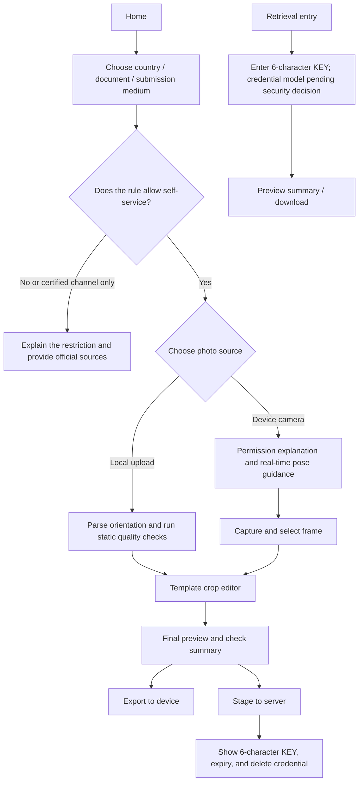

# Portrait Booth — PRODUCT

> Current status: product and technical specification stage; governed by [STATUS.md](../STATUS.md).
> Research baseline: 2026-08-05
> Purpose: define the product problem, goals, boundaries, flows, requirements, and acceptance facts; does not replace the latest rules of any document-issuing authority.

## 1. Product definition

Portrait Booth is an account-free web app. The user first selects the
intended document template; if an applicant class such as child/adult
changes the rules, that class is also selected. The system pins the latest
valid template version, then the user uploads a photo or captures one with
the device camera; the app uses framing guidance and local face-geometry
analysis to help the user adjust frontal angle, distance, and position, and
then offers basic editing - crop, move, zoom, rotate, and mirror - to
produce the target-size photo.

After editing, there are two parallel terminal states:

1. **Export**: download the current final photo to the user's device.
2. **Stage**: save the photo rendered from the same editing terminal state
   to the server, returning a unique 6-character uppercase-alphanumeric KEY
   for later or cross-device retrieval.

"The same terminal state" here is one immutable final artifact: it pins
the template version, crop region, zoom, rotation, mirror, orientation, and
output size. Export and staging are two non-exclusive operations on that
artifact; any further editing invalidates the old artifact and regenerates
it. When the server re-encodes for security, the retrieved file need not be
byte-identical to the local file, but composition, orientation, and pixel
dimensions must match.

## 2. Problem to solve

- Users do not know the photo sizes and composition rules for different
  passports, visas, and documents.
- During selfies it is hard to judge yaw, pitch, roll, distance, eye
  position, and head size at the same time.
- Generic image editors do not understand document templates; correct size
  does not mean correct composition or submission channel.
- Users often shoot on a phone and apply on a computer, or hand the photo
  to a print shop; cross-device transfer is awkward.
- Similar tools often charge at the last step, retain photos long-term on
  servers, or vaguely claim "guaranteed acceptance".

## 3. Target users and jobs to be done

### 3.1 Primary users

- Individuals who occasionally need passport, visa, or other document
  photos.
- Users with only a phone camera and no professional capture equipment.
- Users who need to switch from the capture device to an application or
  print device.
- Users who want manual control over cropping and reject automatic
  beautification or appearance alteration.

### 3.2 Jobs to be Done

- "When I prepare an online document application, I want a photo with the
  correct size and file format quickly, and to know what risks remain."
- "When I take a selfie, I want the app to tell me clearly which way to
  adjust my head, not just say it is unacceptable after the fact."
- "After finishing the photo on my phone, I want to retrieve the result on
  another device with an easy-to-type KEY."
- "When official rules forbid selfies or digital modification, I want to be
  warned before wasting time."

## 4. Product goals and non-goals

### 4.0 Current delivery intent

As of 2026-08-17 the product is delivered as a local development and
demonstration loop: the create → export/stage → KEY retrieval → delete
flows are walked end to end locally (two-process dev topology or the
full-stack Docker container), always bound to the reviewed templates and
their official source text. There is no release environment, no
test-deployment environment, no external users, and no public retrieval
implementation; observable acceptance is that the flows stay walkable
locally with the applicable tests, static checks, and builds passing. The
launch-blocking constraints in §6.2 apply to any future external exposure,
not to the current local demonstration.

### 4.1 MVP goals

- Cover both upload and browser-camera inputs.
- Provide frontal-angle, distance, position, and basic capture-environment
  hints in the camera preview; manual capture stays available when analysis
  is unavailable.
- Have the user first choose country/region, document, submission medium,
  and any required applicant class; the system selects and pins the current
  valid template version before capture and editing.
- Provide template-based crop masks, move, zoom, rotate, mirror, undo, and
  reset.
- Output a single sRGB JPEG and clearly distinguish "size generated",
  "checks passed", and "official final acceptance"; paper templates may only
  be labeled `print-ready` once the JPEG carries the correct print density
  and passes calibrated printing.
- Have export and staging share the same terminal generation step.
- Stage one final artifact without an account, generate a unique
  6-character uppercase-alphanumeric KEY, and allow retrieval by entering
  the KEY.
- Enforce short retention, automatic deletion, proactive deletion, and
  anti-enumeration controls on staged photos.

### 4.2 Later candidates

- Multi-photo print layouts such as 4×6 in and 10×15 cm, and PDFs.
- More country, document, and channel templates reviewed by content
  operations.
- Background-uniformity assistance where rules allow; background
  replacement is evaluated separately and not enabled by default.
- QR codes, private pickup links, or the system share sheet; if a second
  pickup credential is adopted, these enter P0.
- Professional photographer or human review services.
- Offline/PWA, batch photos, and organization-branded templates.

### 4.3 Explicit non-goals

- No passport, visa, or other government application filing.
- No promise that photos will be approved, and no impersonation of an
  issuing authority's official checker.
- No face identity recognition, 1:N face search, or identity verification.
- No beautification, face swapping, feature reshaping, generative face
  completion, or edits that alter real appearance.
- The MVP offers no permanent gallery, account system, social posting,
  physical printing, or payments.
- "Common 35×45 mm" is never treated as a universal legal standard across
  all countries, documents, and channels.

## 5. Product principles

1. **Privacy by default**: uploads, camera frames, face-geometry analysis,
   and ordinary export stay in the browser; the final photo is sent to the
   server only when the user actively chooses "stage".
2. **Applicability first**: templates carry not only dimensions but also the
   application channel, whether self-capture is allowed, whether
   crop/mirror/background handling is allowed, and source dates.
3. **Guide, do not adjudicate**: automatic checks say "what was found, how
   to adjust, which rules were not checked", never unproven "100%
   compliant" copy.
4. **Reversible editing**: every transform can be undone and reset without
   overwriting the user's original photo.
5. **Traceable rules**: every publishable template must have a version,
   official source, and review date; expired rules can be taken down
   remotely.
6. **Accessible degradation**: when face analysis fails, performance is
   insufficient, or the user denies camera permission, upload, manual
   masks, and text guidance still complete the task.

## 6. Core experience

### 6.1 First-time creation

1. The user selects a template by country/region, document type,
   paper/digital, and application channel.
2. The app first shows the key rules, official sources, most recent review
   date, and self-service restrictions; ordinary users do not manually pick
   historical template versions.
3. The user chooses upload or camera. Camera permission is requested only
   after clicking that option.
4. Camera mode guides in order: exactly one face detected, facing the
   camera, head level, correct distance, lighting/sharpness basically
   usable; once steadily stable, an automatic countdown is allowed while a
   manual shutter always remains. Uploaded photos also get one static
   angle/position analysis, suggesting a retake when cropping cannot fix
   it.
5. The user moves and zooms the photo inside the template mask, and may
   rotate or mirror per the template policy.
6. The completion page lists passed items, warnings, unchecked items,
   needs-manual-confirmation items, and the official final review notice.
7. The user chooses export or stage; the two are not chained and neither
   requires downloading or saving first.

### 6.2 Staging and retrieval

- Staging saves only the final photo, never camera video, per-frame
  images, face landmarks, source images, or edit history.
- One stage generates one KEY of total length exactly 6; each position is
  chosen uniformly and independently from `A–Z` or `0–9`, with no required
  letter/digit quota and no requirement that both appear. A KEY must never
  map to another photo over the product's lifetime.
- "One KEY, one photo" is interpreted by save record: the same idempotent
  retry returns the same KEY; a user actively staging again independently
  gets a new KEY, with no global deduplication on portrait content.
- Staging uses a short retention explicitly declared by the service policy;
  the authoritative retention and expected expiry are shown before
  confirmation, and the server-returned absolute `expiresAt` is shown after
  a successful save.
- The success page shows the KEY, expiry, a copy button, and the separate
  delete credential. The delete credential is provided only in the creation
  response, copyable or downloadable as a delete receipt; staging is
  possible within the page session, with no guarantee of recovery after
  closing.
- Cross-device retrieval requires entering the 6-character KEY. Because a
  KEY cannot serve as a strong authentication credential, a public
  retrieval implementation must also satisfy the authorization,
  anti-enumeration, rate-limiting, unified-error, caching, and logging
  constraints in [SPEC](SPEC.md); this repository has no public retrieval
  implementation yet.
- After a successful retrieval, download is allowed. Delete rights and
  download rights are separate: "delete" appears only when the separate
  delete credential was obtained at save time and the current browser still
  holds it; KEY/pickup credentials alone cannot delete, preventing a
  delete-style denial of service by guessers.
- Invalid, expired, and deleted use identical error copy.
- At expiry, all API access is denied immediately, and application-accessible
  primary objects, versions, and temporary copies are deleted within 60
  minutes; the MVP photo bucket has no long-term backups. If infrastructure
  still produces application-unrecoverable disaster-recovery copies, they
  must be separately disclosed and destroyed within no more than 30 days.

> **Launch-blocking risk**: a 6-character KEY from 26 uppercase letters and
> 10 digits has `36^6 = 2,176,782,336` combinations, roughly 31.0 bits, and
> still cannot be treated as a strong authentication credential. If
> cross-device retrieval stays KEY-only, the maximum simultaneously valid
> photo count, the global resolve-request budget, and auto-shutdown
> thresholds must first be defined and accepted in writing, while short
> retention, multi-dimensional rate limiting, escalating delay, failure-
> threshold CAPTCHA, unified errors, and short-lived download sessions ship
> together. CAPTCHA and per-IP rate limiting are not authentication
> substitutes. If retention is extended or scale grows, the product must add
> a second secret or switch to a longer code.

### 6.3 When a template does not apply

- Templates may be marked `reference_only` or `unsupported`, still showing
  the official rules and sources, but without a "submittable artifact"
  promise.
- Examples: Canadian passports require a commercial photographer and
  forbid digital modification; UK online passports require submitting an
  original photo including the upper body, cropped by the official process;
  the [German federal portal](https://verwaltung.bund.de/leistungsverzeichnis/DE/leistung/99085001012000/herausgeber/BY-358/region/09162) states that domestic passport/ID photos use on-site or certified
  cloud transfer from 2025-05-01. These must not be masked by a generic
  crop box.

## 7. MVP feature priorities

| Priority | Capability | MVP outcome |
| --- | --- | --- |
| P0 | Template selection and source disclosure | Filter by country, document, medium, and channel; only reviewed templates enabled |
| P0 | Upload and camera | JPEG/PNG/WebP upload; camera requested under HTTPS; permission denial falls back to upload |
| P0 | Capture guidance | Single-face, yaw/pitch/roll, distance/head-frame, stability, and basic quality hints |
| P0 | Crop editing | Drag, zoom, fine rotation, 90° rotation, mirror, undo, reset |
| P0 | Final checks | Exact-pixel/ratio, head position, and template-policy checks, distinguishing error/warning/unknown |
| P0 | Single-image export | Browser-local sRGB JPEG; EXIF stripped; paper templates get correct PPI and calibrated printing; file spec shown |
| P0 | Staging and retrieval | One photo per KEY, policy-declared fixed short TTL, download, proactive delete, automatic cleanup |
| P0 | Privacy and abuse protection | Clear disclosure and explicit confirmation, minimal storage, rate limiting, CAPTCHA escalation, private object storage |
| P1 | Print layout | 4×6 in / 10×15 cm multi-photo layouts and PDF |
| P1 | Deeper quality checks | Explainable hints for background uniformity, shadows, glare, closed eyes, and mouth state |
| P2 | Professional services | Human review, photographer transfer, physical printing, or paid capabilities |

## 8. Competitors and transferable patterns

Research snapshot as of 2026-08-05; product capabilities, prices, and
privacy policies change, so re-verify before development.

| Product/service | Observed capabilities | Implications for this project |
| --- | --- | --- |
| [PhotoAiD](https://photoaid.com/) / [Passport Photo Online](https://passport-photo.online/how-it-works) | Upload/capture, AI auto-crop and background handling, human review, many templates; download and physical photos | Automated feedback is valuable, but "guaranteed compliance" copy must not be copied; third-party processors and longer retention need clear disclosure |
| [IDPhoto4You](https://www.idphoto4you.com/?Target=HelpPage) | 73-country templates, manual biometric masks, move/zoom/rotate, single and print-layout output | Template masks with transparent manual control suit the MVP; its [privacy page](https://www.idphoto4you.com/?Target=PrivacyPage) showing up to 6-hour retention is a minimization reference |
| [PersoFoto](https://www.persofoto.de/upload/passbild) | Confirmed file upload, capture instructions, biometric masks, free cropping alongside paid services; the page suggests webcam as a capture source but browser-native capture is unconfirmed | The parallel terminal states "download when done or enter the server flow" are closest to this product; its [privacy material](https://www.persofoto.de/de/datenschutz) claims random encrypted links without disclosing length or entropy |
| [123PassportPhoto](https://www.123passportphoto.com/) | Upload, auto/manual crop, background handling, common-country templates and print layouts | Print layout is a clear P1 requirement; its [privacy policy](https://www.123passportphoto.com/privacy.php) states photos are deleted within 1 hour |
| [IDstation.online](https://www.idstation.online/default/Default) | Partner-photographer uploads; users view, download, or delete cross-device with a personal code; CAPTCHA and failure lockout included | The closest commercial reference for KEY retrieval, but its code is case-sensitive alphanumeric with extra anti-automation measures |
| [GOV.UK Photo Code](https://www.passport.service.gov.uk/help/photo-codes) | A 6–8 character short URL path attaches the photo to an online application | Short codes are not the only security boundary: government photo-fetch requests also carry JWS signature verification; this product cannot cite "the government also uses short codes" as a KEY-only security proof |
| [Finnish police photo code](https://poliisi.fi/en/submitting-passport-photographs) | Studios upload photos to the police server; users enter a retrieval code in the application | Validates the cross-device photo-code user value, and shows that credentialed sources and download permissions differ from ordinary cloud galleries |

### 8.1 Differentiation opportunities

- Competitors mostly give static pre-capture instructions and post-capture
  verdicts; real-time, explainable yaw/pitch/roll guidance still has room
  to differentiate.
- Free tools usually lack cross-device retrieval; commercial tools rely on
  email, orders, or long links; an account-free short KEY is a convenience
  and the core security risk.
- "Template size + channel restrictions + editing policy + source version"
  is more credible than piling up country sizes.
- Privacy-default local processing can be an explicit value proposition:
  only "stage" uploads the final photo.

### 8.2 MVP minimum template scope

The hard-minimum Public Beta release manifest follows; apart from the
generic portrait, only individually reviewed adult revisions are released
first. Any failure blocks Public Beta; shrinking the set is a product-scope
change that must update PRODUCT, SPEC, and the release manifest together,
never silently waived at release review:

- Generic portrait 1200×1200 px (explicitly unofficial, mirror allowed,
  for basic portraits and editing capability).
- US passport - paper 2×2 in (50.8×50.8 mm); 600×600 px at the product's
  300 ppi.
- US visa - applicable DS-160/DS-1648 digital photos, 600–1200 px square;
  does not cover DS-260, DV, or mission-specific rules.
- Finnish police document - digital 500×653 px.
- China visa - the first digital revision is fixed at 354×472 px and bound
  to a reviewed concrete acceptance source.
- Japan passport - paper 35×45 mm; 413×531 px at the product's 300 ppi.

US DV enters the current manifest only when the specific program year's
instructions and applicable application window are formally published; it is
not an unconditional release gate, and each year is individually reviewed
and versioned. US and Japan paper templates may become `active` only after
correct PPI encoding and calibrated print tests pass. Child/infant, UK
paper/online passports, Canadian passports, and generic Schengen entries
are presented as `reference_only` or with channel explanations: UK paper
rules publicly forbid cropping from a larger image, the UK online path is
cropped by the official service, and Canada requires the commercial
photographer's original file - none can masquerade as a generic self-
service crop template.

## 9. Acceptance facts

- The user can obtain a photo via local upload or an explicitly authorized
  device camera; when the camera, automatic guidance, or the model is
  unavailable, upload and manual paths still complete the task.
- The user can move, zoom, and crop per the selected template, and rotate
  or mirror per the template policy; preview and final state use the same
  transform rules.
- Export and staging use the same immutable final artifact; after secure
  server re-encoding bytes may differ, but composition, orientation, and
  pixel dimensions must match.
- KEYs must match `^[A-Z0-9]{6}$`; all-letter, all-digit, and any mixed
  forms are valid; the same KEY never maps to another photo.
- Every output shows the template ID, version, source, review date, passed
  items, warnings, and unchecked items.
- Expired or deleted photos are immediately unretrievable; logs, analytics,
  and error tracking contain no photos, KEYs, pickup or delete credentials,
  object-storage identifiers, or face landmarks.
- The final page must never describe heuristic checks as official
  approval, official certification, or an acceptance guarantee.

## 10. Risks and responses

| Risk | Impact | Product response |
| --- | --- | --- |
| Official rule changes or channel differences | Correct output size but rejected application | Template versioning, official sources, review dates, remote takedown, and `reference_only` status |
| 6-character KEYs enumerable | Unauthorized viewing of portraits | Fixed short TTL, layered rate limiting, CAPTCHA, unified errors, private object storage; upgrade the credential model before longer retention or scale growth |
| Automatic-check misjudgment or group bias | Wrong guidance, excluding some users | Explainable checks, confidence, manual bypass, cross-skin-tone/age/assistive-device testing, no identity recognition |
| Camera quality, permission, or performance shortfalls | No capture or low frame rate | Deferred permission requests, upload fallback, disableable real-time analysis, export from raw high-resolution frames |
| Some official rules forbid selfies or editing | Product capability conflicts with rules | Template-level `submissionMode` and `editingPolicy`; unsuitable templates are reference only |
| Upload endpoint used as file hosting | Cost, unlawful content, or malicious files | Only decodable whitelisted images, size/pixel limits, re-encoding, short TTL, quotas, and private downloads |
| Users mistake the mirrored preview for the artifact | Wrong facial orientation or rejection | Front camera may mirror the preview but saves unmirrored by default; official templates forbid or strongly warn about mirroring per policy |
